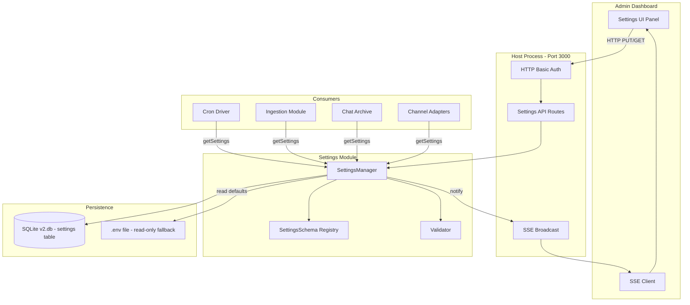
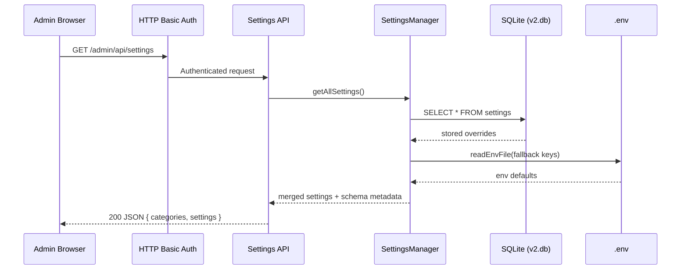
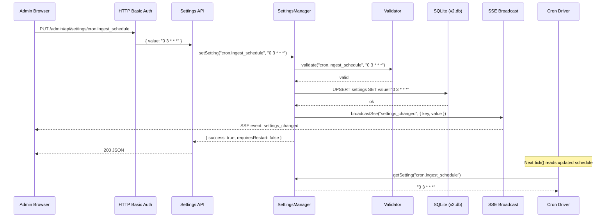

# Design Document: Admin Dashboard Settings

## Overview

The Admin Dashboard Settings feature adds a persistent, user-facing configuration panel to Clawd's existing admin dashboard (served at `/admin` on port 3000). Currently, all configuration lives in `.env` files and requires a service restart to take effect. This feature introduces a settings API and UI that allows the admin to view and modify runtime-configurable parameters — such as cron schedules, ingestion toggles, chat archive mode, notification preferences, and channel adapter options — without editing files or restarting the service.

Settings are persisted in the existing SQLite central database (`data/v2.db`) via a new `settings` table. Changes take effect immediately for hot-reloadable parameters, or on next cron tick for schedule-based ones. The design preserves the existing `.env` as the source of truth for secrets and infrastructure-level config (database DSNs, API keys, paths) while exposing operational knobs through the dashboard.

The feature integrates with the existing HTTP Basic Auth protection on `/admin` routes and uses the same SSE channel for real-time settings sync across multiple open dashboard tabs.

## Architecture



## Sequence Diagrams

### Reading Settings (Dashboard Load)



### Updating a Setting



## Components and Interfaces

### Component 1: SettingsManager

**Purpose**: Central singleton that manages reading, writing, validating, and broadcasting settings changes. Acts as the single source of truth for runtime configuration.

**Interface**:

```pascal
STRUCTURE SettingDefinition
  key: String              -- dot-notation key, e.g. "cron.ingest_schedule"
  category: String         -- grouping: "scheduling", "ingestion", "channels", "notifications"
  label: String            -- human-readable label for UI
  description: String      -- tooltip/help text
  type: Enum(string, number, boolean, enum, cron)
  default_value: String    -- serialized default
  env_fallback: String     -- .env key to read if no DB override exists (nullable)
  options: String[]        -- for type=enum, valid choices
  requires_restart: Boolean
  validation_pattern: String  -- regex for string validation (nullable)
  min: Number             -- for type=number (nullable)
  max: Number             -- for type=number (nullable)
END STRUCTURE

STRUCTURE SettingValue
  key: String
  value: String           -- always stored as string, parsed by consumers
  source: Enum(database, env, default)
  updated_at: String      -- ISO 8601
  updated_by: String      -- "admin" or "system"
END STRUCTURE
```

**Responsibilities**:

- Register setting definitions at startup (schema registry)
- Read settings with fallback chain: DB → .env → default
- Validate values against schema before persisting
- Persist overrides to SQLite
- Broadcast changes via SSE to connected dashboard clients
- Provide typed getters for consuming modules

### Component 2: Settings API Routes

**Purpose**: HTTP endpoints mounted under `/admin/api/settings` that expose CRUD operations on settings, protected by the existing Basic Auth middleware.

**Interface**:

```pascal
-- GET /admin/api/settings
-- Returns all settings grouped by category with current values and metadata

-- GET /admin/api/settings/:key
-- Returns a single setting's value, metadata, and source

-- PUT /admin/api/settings/:key
-- Body: { "value": "<new_value>" }
-- Validates and persists the new value, broadcasts change

-- POST /admin/api/settings/reset/:key
-- Resets a setting to its default (deletes DB override)

-- POST /admin/api/settings/export
-- Returns all non-default settings as a JSON blob for backup

-- POST /admin/api/settings/import
-- Accepts a JSON blob and bulk-applies settings (with validation)
```

**Responsibilities**:

- Parse and route settings HTTP requests
- Delegate to SettingsManager for business logic
- Return structured JSON responses with appropriate HTTP status codes
- Handle validation errors with descriptive messages

### Component 3: Settings UI Panel

**Purpose**: Client-side HTML/JS panel rendered within the existing admin dashboard, providing a categorized form interface for viewing and editing settings.

**Responsibilities**:

- Render settings grouped by category with appropriate input controls
- Show setting source (database override vs. env fallback vs. default)
- Provide inline validation feedback
- Listen to SSE for real-time sync across tabs
- Show restart-required indicators where applicable
- Support export/import for settings backup

### Component 4: Settings Schema Registry

**Purpose**: Static registry of all configurable settings with their metadata, validation rules, and defaults. Populated at module load time.

**Responsibilities**:

- Define the canonical list of settings
- Provide validation rules per setting type
- Map settings to their consuming modules
- Track which settings are hot-reloadable vs. restart-required

## Data Models

### Settings Table (SQLite)

```pascal
STRUCTURE settings_table
  key         : String PRIMARY KEY   -- dot-notation, e.g. "cron.ingest_schedule"
  value       : String NOT NULL      -- serialized value
  updated_at  : String NOT NULL      -- ISO 8601
  updated_by  : String NOT NULL      -- "admin" | "system" | "import"
END STRUCTURE
```

**Migration SQL**:

```sql
CREATE TABLE IF NOT EXISTS settings (
  key        TEXT PRIMARY KEY,
  value      TEXT NOT NULL,
  updated_at TEXT NOT NULL,
  updated_by TEXT NOT NULL DEFAULT 'system'
);
CREATE INDEX idx_settings_updated ON settings(updated_at);
```

**Validation Rules**:

- `key` must match pattern `^[a-z][a-z0-9_]*(\.[a-z][a-z0-9_]*)+$`
- `value` must pass the type-specific validator for the setting's registered type
- `updated_at` must be valid ISO 8601
- `updated_by` must be one of: `admin`, `system`, `import`

### Settings Categories and Keys

```pascal
STRUCTURE SettingsRegistry
  -- Scheduling
  "cron.ingest_schedule"       : cron    DEFAULT "0 2 * * *"
  "cron.wiki_schedule"         : cron    DEFAULT "0 3 * * *"
  "cron.gc_schedule"           : cron    DEFAULT "0 4 * * *"
  "cron.digest_schedule"       : cron    DEFAULT "0 7 * * *"

  -- Ingestion
  "ingestion.google_enabled"   : boolean DEFAULT true
  "ingestion.apple_enabled"    : boolean DEFAULT true
  "ingestion.github_enabled"   : boolean DEFAULT true
  "ingestion.slack_enabled"    : boolean DEFAULT false
  "ingestion.lookback_hours"   : number  DEFAULT 24, MIN 1, MAX 168

  -- Chat Archive
  "chat.archive_mode"          : enum    DEFAULT "off"
                                         OPTIONS ["off", "self", "dms", "all"]

  -- Notifications
  "notifications.digest_enabled"    : boolean DEFAULT true
  "notifications.digest_timezone"   : string  DEFAULT "Asia/Singapore"
                                              PATTERN "^[A-Za-z]+/[A-Za-z_]+$"

  -- Channels
  "channels.whatsapp_enabled"       : boolean DEFAULT true
  "channels.telegram_enabled"       : boolean DEFAULT true
  "channels.batch_window_ms"        : number  DEFAULT 5000, MIN 1000, MAX 30000

  -- Container
  "container.idle_timeout_ms"       : number  DEFAULT 1800000, MIN 60000, MAX 7200000
  "container.max_concurrent"        : number  DEFAULT 5, MIN 1, MAX 20

  -- Knowledge Base
  "kb.gc_importance_threshold"      : number  DEFAULT 0.5, MIN 0.0, MAX 1.0
  "kb.gc_candidate_limit"           : number  DEFAULT 50, MIN 10, MAX 500
END STRUCTURE
```

## Algorithmic Pseudocode

### Main Settings Resolution Algorithm

```pascal
ALGORITHM resolveSettingValue(key)
INPUT: key of type String
OUTPUT: SettingValue (value + source)

BEGIN
  -- Step 1: Look up schema definition
  definition ← SCHEMA_REGISTRY.get(key)
  IF definition IS NULL THEN
    RAISE Error("Unknown setting: " + key)
  END IF

  -- Step 2: Check database override (highest priority)
  row ← DB.query("SELECT value, updated_at, updated_by FROM settings WHERE key = ?", key)
  IF row IS NOT NULL THEN
    RETURN SettingValue(
      key: key,
      value: row.value,
      source: "database",
      updated_at: row.updated_at,
      updated_by: row.updated_by
    )
  END IF

  -- Step 3: Check .env fallback (if defined)
  IF definition.env_fallback IS NOT NULL THEN
    envValue ← readEnvFile([definition.env_fallback])
    IF envValue[definition.env_fallback] IS NOT EMPTY THEN
      RETURN SettingValue(
        key: key,
        value: envValue[definition.env_fallback],
        source: "env",
        updated_at: "boot",
        updated_by: "system"
      )
    END IF
  END IF

  -- Step 4: Return schema default (lowest priority)
  RETURN SettingValue(
    key: key,
    value: definition.default_value,
    source: "default",
    updated_at: "boot",
    updated_by: "system"
  )
END
```

**Preconditions:**

- `key` is a non-empty string
- SCHEMA_REGISTRY is initialized (module loaded)
- DB connection is available

**Postconditions:**

- Returns a valid SettingValue with source indicating provenance
- Never returns null — always falls through to default
- Does not mutate any state

**Loop Invariants:** N/A (no loops)

### Setting Update Algorithm

```pascal
ALGORITHM updateSetting(key, newValue, actor)
INPUT: key of type String, newValue of type String, actor of type String
OUTPUT: UpdateResult (success, requiresRestart, previousValue)

BEGIN
  -- Step 1: Validate key exists in schema
  definition ← SCHEMA_REGISTRY.get(key)
  IF definition IS NULL THEN
    RETURN Error("Unknown setting key")
  END IF

  -- Step 2: Validate value against type constraints
  validationResult ← validateValue(definition, newValue)
  IF validationResult.valid IS FALSE THEN
    RETURN Error(validationResult.message)
  END IF

  -- Step 3: Read previous value for audit
  previousValue ← resolveSettingValue(key)

  -- Step 4: Persist to database (UPSERT)
  now ← currentTimestamp()
  DB.execute(
    "INSERT INTO settings (key, value, updated_at, updated_by) " +
    "VALUES (?, ?, ?, ?) " +
    "ON CONFLICT(key) DO UPDATE SET value=?, updated_at=?, updated_by=?",
    key, newValue, now, actor, newValue, now, actor
  )

  -- Step 5: Broadcast change to SSE clients
  broadcastSse("settings_changed", {
    key: key,
    value: newValue,
    source: "database",
    updated_at: now,
    requires_restart: definition.requires_restart
  })

  -- Step 6: Audit log
  audit("SETTINGS_CHANGED | key=" + key + " prev=" + previousValue.value +
        " new=" + newValue + " by=" + actor)

  RETURN UpdateResult(
    success: true,
    requiresRestart: definition.requires_restart,
    previousValue: previousValue.value
  )
END
```

**Preconditions:**

- `key` is a non-empty string registered in SCHEMA_REGISTRY
- `newValue` is a non-null string
- `actor` is one of "admin", "system", "import"
- Database is writable

**Postconditions:**

- Setting is persisted in the database
- SSE broadcast sent to all connected clients
- Audit log entry written
- Returns success with restart indicator

**Loop Invariants:** N/A

### Value Validation Algorithm

```pascal
ALGORITHM validateValue(definition, value)
INPUT: definition of type SettingDefinition, value of type String
OUTPUT: ValidationResult (valid, message)

BEGIN
  SWITCH definition.type
    CASE "boolean":
      IF value NOT IN ["true", "false"] THEN
        RETURN ValidationResult(false, "Must be 'true' or 'false'")
      END IF

    CASE "number":
      numVal ← parseFloat(value)
      IF numVal IS NaN THEN
        RETURN ValidationResult(false, "Must be a valid number")
      END IF
      IF definition.min IS NOT NULL AND numVal < definition.min THEN
        RETURN ValidationResult(false, "Must be >= " + definition.min)
      END IF
      IF definition.max IS NOT NULL AND numVal > definition.max THEN
        RETURN ValidationResult(false, "Must be <= " + definition.max)
      END IF

    CASE "enum":
      IF value NOT IN definition.options THEN
        RETURN ValidationResult(false, "Must be one of: " + join(definition.options, ", "))
      END IF

    CASE "cron":
      IF NOT matchesCronPattern(value) THEN
        RETURN ValidationResult(false, "Must be a valid cron expression (M H * * *)")
      END IF

    CASE "string":
      IF definition.validation_pattern IS NOT NULL THEN
        IF NOT matches(value, definition.validation_pattern) THEN
          RETURN ValidationResult(false, "Does not match required pattern")
        END IF
      END IF
  END SWITCH

  RETURN ValidationResult(true, "")
END
```

**Preconditions:**

- `definition` is a valid SettingDefinition with type set
- `value` is a non-null string

**Postconditions:**

- Returns valid=true if value passes all constraints
- Returns valid=false with descriptive message on failure
- No side effects

**Loop Invariants:** N/A

### Bulk Import Algorithm

```pascal
ALGORITHM importSettings(settingsJson, actor)
INPUT: settingsJson of type Map<String, String>, actor of type String
OUTPUT: ImportResult (applied, skipped, errors)

BEGIN
  applied ← []
  skipped ← []
  errors ← []

  FOR EACH (key, value) IN settingsJson DO
    -- Invariant: all previously processed entries are categorized
    -- into exactly one of applied, skipped, or errors

    definition ← SCHEMA_REGISTRY.get(key)
    IF definition IS NULL THEN
      errors.add({ key: key, message: "Unknown setting" })
      CONTINUE
    END IF

    validationResult ← validateValue(definition, value)
    IF validationResult.valid IS FALSE THEN
      errors.add({ key: key, message: validationResult.message })
      CONTINUE
    END IF

    currentValue ← resolveSettingValue(key)
    IF currentValue.value EQUALS value THEN
      skipped.add(key)
      CONTINUE
    END IF

    updateSetting(key, value, actor)
    applied.add(key)
  END FOR

  audit("SETTINGS_IMPORT | applied=" + length(applied) +
        " skipped=" + length(skipped) + " errors=" + length(errors))

  RETURN ImportResult(applied, skipped, errors)
END
```

**Preconditions:**

- `settingsJson` is a valid map of string key-value pairs
- `actor` is a valid actor string

**Postconditions:**

- Every entry in settingsJson is categorized into applied, skipped, or errors
- `length(applied) + length(skipped) + length(errors) = length(settingsJson)`
- All applied settings are persisted and broadcast

**Loop Invariants:**

- All previously processed entries are in exactly one of the three result lists
- Database remains consistent (each update is atomic)

## Key Functions with Formal Specifications

### Function: getAllSettings()

```pascal
PROCEDURE getAllSettings()
  OUTPUT: Array of CategoryGroup
```

**Preconditions:**

- SCHEMA_REGISTRY is initialized
- Database connection is available

**Postconditions:**

- Returns all registered settings grouped by category
- Each setting includes current value, source, and metadata
- Categories are sorted alphabetically
- Settings within categories are sorted by key

### Function: getSetting(key)

```pascal
PROCEDURE getSetting(key)
  INPUT: key of type String
  OUTPUT: String (the resolved value)
```

**Preconditions:**

- `key` is registered in SCHEMA_REGISTRY

**Postconditions:**

- Returns the resolved value as a string
- Resolution order: database → env → default
- Throws if key is unknown

### Function: getTypedSetting(key, type)

```pascal
PROCEDURE getTypedSetting(key, type)
  INPUT: key of type String, type of type TypeTag
  OUTPUT: value of type matching TypeTag
```

**Preconditions:**

- `key` is registered in SCHEMA_REGISTRY
- `type` matches the registered type for `key`

**Postconditions:**

- Returns the value parsed to the correct type (number, boolean, string)
- Throws if parsing fails (should not happen if validation is correct)

### Function: resetSetting(key)

```pascal
PROCEDURE resetSetting(key)
  INPUT: key of type String
  OUTPUT: ResetResult (previousValue, newValue, source)
```

**Preconditions:**

- `key` is registered in SCHEMA_REGISTRY

**Postconditions:**

- Database override for `key` is deleted
- Value falls back to env or default
- SSE broadcast sent
- Audit log entry written

## Example Usage

```pascal
-- Example 1: Module reading a setting at runtime
SEQUENCE
  manager ← getSettingsManager()
  schedule ← manager.getSetting("cron.ingest_schedule")
  -- schedule = "0 2 * * *" (from DB, env, or default)
  nextRun ← nextRunFromCron(schedule)
END SEQUENCE

-- Example 2: API handler updating a setting
SEQUENCE
  body ← parseRequestBody(request)
  key ← request.params.key    -- "chat.archive_mode"
  value ← body.value          -- "self"

  result ← settingsManager.updateSetting(key, value, "admin")

  IF result.success THEN
    respond(200, { success: true, requiresRestart: result.requiresRestart })
  ELSE
    respond(400, { error: result.message })
  END IF
END SEQUENCE

-- Example 3: Cron driver using hot-reloaded schedule
SEQUENCE
  -- On each tick(), read schedule from SettingsManager instead of hardcoded constant
  FOR EACH job IN SCHEDULES DO
    scheduleKey ← "cron." + job.name + "_schedule"
    currentCron ← settingsManager.getSetting(scheduleKey)
    nextRun ← nextRunFromCron(currentCron, now)
    -- ... existing tick logic using dynamic schedule
  END FOR
END SEQUENCE

-- Example 4: Export/Import for backup
SEQUENCE
  -- Export
  allOverrides ← settingsManager.exportOverrides()
  -- Returns: { "cron.ingest_schedule": "0 3 * * *", "chat.archive_mode": "self" }

  -- Import on another machine
  importResult ← settingsManager.importSettings(allOverrides, "import")
  DISPLAY "Applied: " + importResult.applied.length
  DISPLAY "Errors: " + importResult.errors.length
END SEQUENCE
```

## Correctness Properties

### Property 1: Resolution Determinism

For any setting key `k`, calling `resolveSettingValue(k)` multiple times without intervening writes always returns the same value.

### Property 2: Fallback Chain Completeness

Every registered setting always resolves to a value — the chain DB → env → default guarantees no null returns. For all keys `k` in SCHEMA_REGISTRY, `resolveSettingValue(k)` never returns null or throws.

### Property 3: Validation Soundness

If `validateValue(def, v)` returns `valid=true`, then `v` is safe to persist and will be correctly parsed by consumers. Conversely, if it returns `valid=false`, persisting `v` would violate type constraints.

### Property 4: Idempotent Writes

Calling `updateSetting(k, v, actor)` twice with the same arguments produces the same database state (UPSERT semantics). The second call does not create a duplicate row or change the value.

### Property 5: Import Totality

For any import map of size N, `length(applied) + length(skipped) + length(errors) = N` — every entry is accounted for in exactly one result category.

### Property 6: Broadcast Consistency

After a successful `updateSetting`, all connected SSE clients receive a `settings_changed` event with the new value before the HTTP response is sent to the caller.

### Property 7: Schema Immutability at Runtime

The SCHEMA_REGISTRY is populated at module load and never modified during execution. Settings can only be created for keys that exist in the registry.

### Property 8: Source Truthfulness

The `source` field in SettingValue accurately reflects where the value was read from — "database" only if a row exists in the settings table, "env" only if the corresponding env var is set, "default" otherwise.

## Error Handling

### Error Scenario 1: Unknown Setting Key

**Condition**: API receives a PUT/GET for a key not in SCHEMA_REGISTRY
**Response**: 404 JSON `{ "error": "Unknown setting", "key": "<key>" }`
**Recovery**: No state change; client shows error message

### Error Scenario 2: Validation Failure

**Condition**: Value does not pass type/range/pattern validation
**Response**: 400 JSON `{ "error": "Validation failed", "key": "<key>", "message": "<details>" }`
**Recovery**: No state change; client shows inline validation error

### Error Scenario 3: Database Write Failure

**Condition**: SQLite write fails (disk full, corruption, locked)
**Response**: 500 JSON `{ "error": "Failed to persist setting" }`
**Recovery**: Setting remains at previous value; audit log records failure; admin notified via SSE error event

### Error Scenario 4: Import Partial Failure

**Condition**: Some settings in an import batch fail validation
**Response**: 207 JSON with per-key results `{ "applied": [...], "errors": [...] }`
**Recovery**: Valid settings are applied; invalid ones are reported; no rollback of valid writes

### Error Scenario 5: Concurrent Modification

**Condition**: Two admin tabs update the same setting simultaneously
**Response**: Last-write-wins (SQLite serializes writes); both tabs receive SSE update with final value
**Recovery**: No data loss; UI reflects the winning value via SSE sync

## Testing Strategy

### Unit Testing Approach

- Test `validateValue` for each type with valid/invalid/boundary inputs
- Test `resolveSettingValue` fallback chain with mocked DB and env
- Test `updateSetting` persists correctly and returns proper metadata
- Test `importSettings` handles mixed valid/invalid/duplicate entries
- Test cron pattern validation accepts `M H * * *` and rejects invalid patterns

**Coverage goal**: 90%+ line coverage on SettingsManager and Validator

### Property-Based Testing Approach

**Property Test Library**: fast-check (already in devDependencies)

Properties to test:

- For any registered key, `resolveSettingValue` never throws and always returns a value
- For any value that passes `validateValue`, round-tripping through `updateSetting` + `getSetting` returns the same value
- Import totality: for any random map of N entries, result counts sum to N
- Idempotency: `updateSetting(k, v)` called twice produces identical DB state

### Integration Testing Approach

- Test full HTTP request cycle: auth → API → SettingsManager → DB → SSE broadcast
- Test that cron driver picks up schedule changes without restart
- Test that chat archive module reads mode changes in real time
- Test export → import round-trip preserves all settings

## Performance Considerations

- **Read path**: Settings are read frequently by cron (every 60s) and per-message (chat archive mode check). The SQLite read is fast (<1ms) but we cache resolved values in-memory with a 5-second TTL to avoid repeated disk I/O on hot paths.
- **Write path**: Settings changes are rare (admin action). No caching concerns — write-through to DB + invalidate cache.
- **SSE overhead**: Broadcasting a settings change to connected clients is O(clients), typically 1-3 tabs. Negligible.
- **Startup**: Schema registry population is synchronous at module load — ~20 settings, no measurable impact.

## Security Considerations

- **Authentication**: All settings endpoints are behind the existing HTTP Basic Auth + rate limiting. No new auth surface.
- **Authorization**: Single admin role (same as existing dashboard). No per-setting ACLs needed for single-user Clawd.
- **Secrets exclusion**: Settings that contain secrets (API keys, passwords, tokens) are NOT exposed through this feature. They remain in `.env` only. The schema registry explicitly marks which keys are safe to expose.
- **Input validation**: All values are validated against schema before persistence. No raw SQL injection risk (parameterized queries via better-sqlite3).
- **Export security**: The export endpoint only includes non-secret settings. Import validates every value before applying.
- **Audit trail**: Every settings change is logged to the audit file with timestamp, actor, previous value, and new value.

## Dependencies

- **better-sqlite3** (existing) — persistence layer for the settings table
- **No new dependencies** — the feature uses existing infrastructure:
  - HTTP server (already running on port 3000)
  - SSE broadcast (already implemented in admin-dashboard)
  - Basic Auth (already implemented)
  - Audit logging (already implemented in clawd.ts)
  - readEnvFile utility (existing in src/env.ts)
