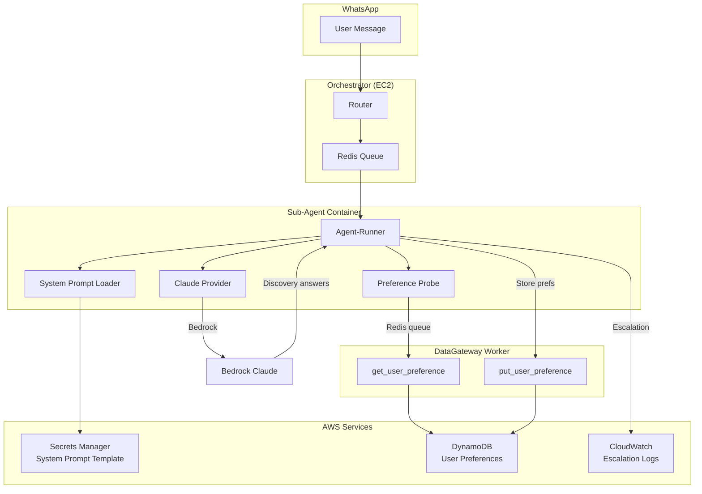
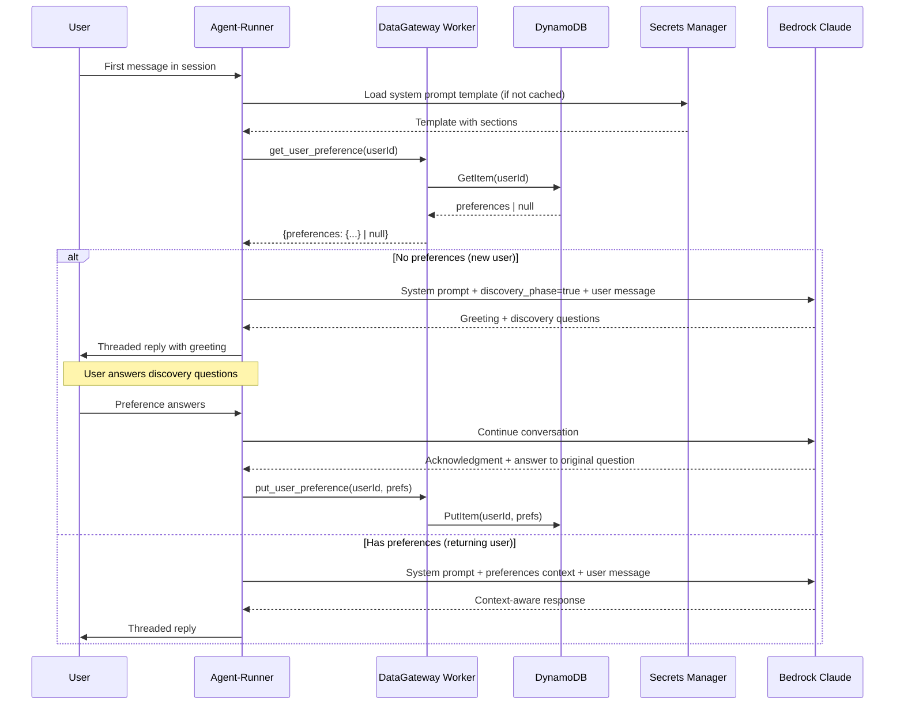

# Design Document: Clawd Bot Persona

## Overview

This design defines the technical implementation of Clawd's persona framework — the behavioral layer that governs how the NanoClaw WhatsApp AI assistant interacts with users. The feature is primarily **system-prompt-driven**: most persona behaviors (tone, guardrails, coding style, confidence tiers) are encoded in a structured system prompt sent to Bedrock Claude. The application logic handles the surrounding mechanics: new-user detection, preference storage/retrieval, threaded reply routing, escalation event logging, and system prompt hot-reload.

The design spans two layers:

1. **System Prompt Template** — A versioned, sectioned prompt stored in AWS Secrets Manager that encodes Clawd's identity, behavioral rules, and response guidelines. Loaded at session initialization and refreshable without container restart.
2. **Application Logic** — Modifications to the sub-agent (Python/FastAPI) and DataGateway Worker (Node.js/TypeScript) to support discovery phase routing, preference persistence, escalation logging, and threaded reply mechanics.

### Key Design Decisions

- **System prompt as single source of truth for persona**: Behavioral rules (tone, guardrails, confidence handling) live in the prompt template, not in application code. This allows persona iteration without deployments.
- **Extend existing `UserPreferences` model**: Add `technical_depth` and `primary_domain` fields to the existing DynamoDB preferences schema rather than creating a new table.
- **Add `put_user_preference` action to DataGateway Worker**: The worker currently only supports `get_user_preference`. We need the write path for discovery phase completion.
- **Skill-based discovery phase**: The discovery flow is implemented as a skill (like the existing `welcome` skill) that the system prompt activates conditionally based on preference state.
- **Escalation as a structured event**: Escalation events are logged to DynamoDB (new `escalation-events` item type in the existing errors table) and CloudWatch, with the sub-agent informing the user and exiting the session loop.

## Architecture



### Session Initialization Flow



## Components and Interfaces

### 1. System Prompt Template

The system prompt is a structured template stored in AWS Secrets Manager (key: `nanoclaw/system-prompt-template` or as a field within the existing `nanoclaw/app-config` secret). It is divided into named sections that map to requirements:

```typescript
interface SystemPromptTemplate {
  version: string;           // Semantic version for tracking changes
  sections: {
    identity: string;        // Clawd's name, role, personality baseline
    onboarding: string;      // Discovery phase instructions + question templates
    responseStyle: string;   // Tone, conciseness, numbered lists, citations
    guardrails: string;      // Forbidden phrases, anti-injection rules
    confidence: string;      // Tier definitions and behavior per tier
    coding: string;          // Code formatting, version assumptions, deprecation flags
    escalation: string;      // Trigger conditions and handoff script
  };
  updatedAt: string;         // ISO 8601 timestamp
}
```

The agent-runner assembles the final system prompt by concatenating sections with the runtime addendum (identity/destinations from `buildSystemPromptAddendum`).

### 2. Preference Probe (Sub-Agent Enhancement)

A new module in the sub-agent's message processing pipeline that queries user preferences before invoking the LLM:

```python
# src/persona/preference_probe.py

@dataclass
class UserPersonaContext:
    """Context derived from stored preferences for prompt injection."""
    is_new_user: bool
    technical_depth: str | None  # "detailed" | "high-level"
    primary_domain: str | None   # "frontend" | "infrastructure" | "data"

async def probe_user_preferences(redis: Redis, user_id: str) -> UserPersonaContext:
    """Query DataGateway for user preferences. Returns context for prompt assembly."""
    ...
```

### 3. DataGateway Worker Extension

Add `put_user_preference` action handler to the existing DataGateway Worker:

```typescript
// New action in src/cloud/data-gateway-worker/index.ts
case 'put_user_preference':
    await handlePutUserPreference(services, userId, request);
    break;

async function handlePutUserPreference(
    services: CloudServices,
    userId: string,
    request: Record<string, unknown>,
): Promise<void> {
    if (!userId) return;
    const preferences = request.preferences as Partial<UserPreferences>;
    if (!preferences) return;

    // Merge with existing preferences (don't overwrite unrelated fields)
    const existing = await services.dataGateway.getUserPreference(userId);
    const merged = { ...existing, ...preferences };
    await services.dataGateway.putUserPreference(userId, merged as UserPreferences);
}
```

### 4. Extended UserPreferences Schema

Extend the existing `UserPreferences` interface to include persona-specific fields:

```typescript
export interface UserPreferences {
    // Existing fields
    autoSave: boolean;
    notificationTime: string;
    slideTemplate: 'Corporate' | 'Modern' | 'Elegant' | 'Informative';
    consentGiven: boolean;
    consentTimestamp?: string;

    // New persona fields (Requirement 1, 9)
    technical_depth?: 'detailed' | 'high-level';
    primary_domain?: 'frontend' | 'infrastructure' | 'data';
    discoveryCompleted?: boolean;
    discoveryCompletedAt?: string;  // ISO 8601
}
```

### 5. Escalation Logger

A utility that logs escalation events to both DynamoDB (via DataGateway) and CloudWatch:

```python
# src/persona/escalation.py

@dataclass
class EscalationEvent:
    user_id: str
    trigger: str          # "consecutive_failures" | "unknown_domain" | "compliance_sensitive"
    context: str          # Summary of what triggered escalation
    session_id: str
    timestamp: str        # ISO 8601
    message_ids: list[str]  # Related message IDs

async def log_escalation(redis: Redis, event: EscalationEvent) -> None:
    """Log escalation to DynamoDB via DataGateway and emit CloudWatch metric."""
    ...
```

### 6. Threaded Reply Routing

The agent-runner already captures `inReplyTo` in its routing context. For the persona feature, the system prompt instructs Claude to produce one response per inbound message. The agent-runner maps each response to the correct `inReplyTo` message ID when writing to `messages_out`:

```typescript
// In poll-loop.ts — when multiple inbound messages are batched
// The system prompt instructs Claude to delimit responses per-message
// Agent-runner parses delimiters and routes each segment to its source message
interface ThreadedResponse {
    inReplyTo: string;   // Original message ID
    content: string;     // Response text for that specific message
}
```

### 7. System Prompt Hot-Reload

The system prompt template is cached in-memory with a TTL. On each new session initialization (not per-message), the agent-runner checks if the cached version is stale:

```typescript
// In agent-runner system prompt loader
interface CachedPrompt {
    template: SystemPromptTemplate;
    loadedAt: number;    // Unix timestamp
    ttlMs: number;       // Default: 300_000 (5 minutes)
}

function shouldReload(cached: CachedPrompt): boolean {
    return Date.now() - cached.loadedAt > cached.ttlMs;
}
```

## Data Models

### DynamoDB: User Preferences Table (`nanoclaw-user-preferences`)

| Attribute | Type | Description |
|-----------|------|-------------|
| userId (PK) | String | User identifier |
| autoSave | Boolean | Existing field |
| notificationTime | String | Existing field |
| slideTemplate | String | Existing field |
| consentGiven | Boolean | Existing field |
| consentTimestamp | String | Existing field |
| technical_depth | String | "detailed" or "high-level" |
| primary_domain | String | "frontend", "infrastructure", or "data" |
| discoveryCompleted | Boolean | Whether discovery phase finished |
| discoveryCompletedAt | String | ISO 8601 timestamp |

### DynamoDB: Escalation Events (in `nanoclaw-system-errors` table)

| Attribute | Type | Description |
|-----------|------|-------------|
| userId (PK) | String | User identifier |
| timestamp (SK) | String | ISO 8601 |
| errorType | String | "escalation" |
| trigger | String | "consecutive_failures", "unknown_domain", "compliance_sensitive" |
| context | String | Summary of escalation trigger |
| sessionId | String | Active session ID |
| messageIds | List | Related message IDs |

### System Prompt Template (Secrets Manager)

Stored as a JSON string in `nanoclaw/app-config` under a `systemPromptTemplate` key, or as a standalone secret `nanoclaw/system-prompt`. The template is versioned and structured into sections as defined in the Components section above.

### Redis Queue Messages (New Actions)

**put_user_preference request:**

```json
{
    "action": "put_user_preference",
    "user_id": "user-123",
    "request_id": "abc123",
    "preferences": {
        "technical_depth": "detailed",
        "primary_domain": "frontend",
        "discoveryCompleted": true,
        "discoveryCompletedAt": "2024-01-15T10:30:00Z"
    }
}
```

**log_escalation request:**

```json
{
    "action": "log_system_error",
    "user_id": "user-123",
    "error": {
        "errorType": "escalation",
        "message": "Three consecutive failed resolutions",
        "stackTrace": "{\"trigger\":\"consecutive_failures\",\"sessionId\":\"sess-456\",\"messageIds\":[\"msg-1\",\"msg-2\",\"msg-3\"]}"
    }
}
```

## Correctness Properties

*A property is a characteristic or behavior that should hold true across all valid executions of a system — essentially, a formal statement about what the system should do. Properties serve as the bridge between human-readable specifications and machine-verifiable correctness guarantees.*

### Property 1: User routing correctness based on preference state

*For any* user ID, the routing decision SHALL be deterministic: if no stored preferences exist (or `discoveryCompleted` is false/absent), the system routes to the discovery phase; if stored preferences exist with `discoveryCompleted` = true, the system routes to the context-aware greeting flow. No other outcome is possible.

**Validates: Requirements 1.1, 2.1, 9.3, 9.4**

### Property 2: Preference storage round-trip

*For any* valid `UserPreferences` object containing `technical_depth` ∈ {"detailed", "high-level"} and `primary_domain` ∈ {"frontend", "infrastructure", "data"}, storing via `put_user_preference` and then retrieving via `get_user_preference` SHALL return an object with identical `technical_depth`, `primary_domain`, and `discoveryCompleted` values, and SHALL NOT corrupt any pre-existing preference fields.

**Validates: Requirements 1.3, 9.1**

### Property 3: Threaded reply maps responses to source messages

*For any* batch of N distinct inbound messages (N ≥ 1), the system SHALL produce exactly N outbound responses, each with an `inReplyTo` field matching the message ID of its corresponding inbound message, with no duplicates and no orphans.

**Validates: Requirements 3.1, 3.2**

### Property 4: Escalation triggers on consecutive failures

*For any* sequence of resolution outcomes in a session, an escalation event SHALL be triggered if and only if three consecutive outcomes are failures. The escalation event SHALL contain the trigger "consecutive_failures" and reference the message IDs of the three failed messages.

**Validates: Requirements 8.1**

### Property 5: System prompt template assembly preserves all sections

*For any* valid `SystemPromptTemplate` with all sections populated (identity, onboarding, responseStyle, guardrails, confidence, coding, escalation), assembling the final system prompt SHALL include content from every section in the output string, with no section omitted or empty.

**Validates: Requirements 10.1, 10.3**

## Error Handling

| Scenario | Handling Strategy |
|----------|-------------------|
| DataGateway timeout on preference probe | Treat as new user (fail-open to discovery). Log warning. Retry on next message. |
| Secrets Manager unavailable for prompt load | Use last cached template. If no cache exists, use hardcoded fallback prompt with minimal persona rules. Log error. |
| Preference write fails after discovery | Retry up to 3 times with exponential backoff. If all fail, log error and continue — user will re-enter discovery on next session. |
| Escalation log write fails | Best-effort: log to CloudWatch directly from sub-agent. Don't block user-facing response. |
| Invalid preference values from user | Validate against allowed enums before storage. If invalid, re-ask the question. |
| System prompt template parse error | Fall back to previous valid cached version. Alert via CloudWatch alarm. |
| Redis connection lost during preference probe | Return `is_new_user: true` (fail-open). The poll loop's existing reconnection logic handles recovery. |

## Testing Strategy

### Unit Tests (Example-Based)

- **Preference probe**: Test that `probe_user_preferences` correctly returns `is_new_user: true` when DataGateway returns null, and `is_new_user: false` with populated fields when preferences exist.
- **System prompt assembly**: Test that all template sections are concatenated in the correct order with proper delimiters.
- **Escalation trigger logic**: Test the consecutive-failure counter increments correctly and resets on successful resolution.
- **Threaded reply parsing**: Test that multi-response output from Claude is correctly split and mapped to source message IDs.
- **Preference validation**: Test that invalid enum values are rejected.

### Property-Based Tests

Property-based testing applies to the pure logic components of this feature:

- **Library**: `fast-check` (TypeScript) for DataGateway/agent-runner logic, `hypothesis` (Python) for sub-agent logic
- **Minimum iterations**: 100 per property
- **Tag format**: `Feature: clawd-bot-persona, Property {N}: {description}`

Properties to implement:

1. User routing correctness (Property 1) — `Feature: clawd-bot-persona, Property 1: User routing correctness based on preference state`
2. Preference storage round-trip (Property 2) — `Feature: clawd-bot-persona, Property 2: Preference storage round-trip`
3. Threaded reply mapping (Property 3) — `Feature: clawd-bot-persona, Property 3: Threaded reply maps responses to source messages`
4. Escalation trigger logic (Property 4) — `Feature: clawd-bot-persona, Property 4: Escalation triggers on consecutive failures`
5. System prompt assembly (Property 5) — `Feature: clawd-bot-persona, Property 5: System prompt template assembly preserves all sections`

### Integration Tests

- **End-to-end discovery flow**: Send a message from a new user → verify discovery questions → send answers → verify preferences stored → verify next message skips discovery.
- **Escalation flow**: Simulate three consecutive failed resolutions → verify escalation event in DynamoDB and CloudWatch.
- **Hot-reload**: Update system prompt in Secrets Manager → verify next session uses updated prompt without container restart.
- **DataGateway put_user_preference**: Verify the new action handler correctly merges and persists preferences.

### Smoke Tests

- System prompt template loads successfully from Secrets Manager on container startup.
- DataGateway Worker responds to `get_user_preference` and `put_user_preference` actions.
- Sub-agent health endpoint returns healthy after persona module initialization.
