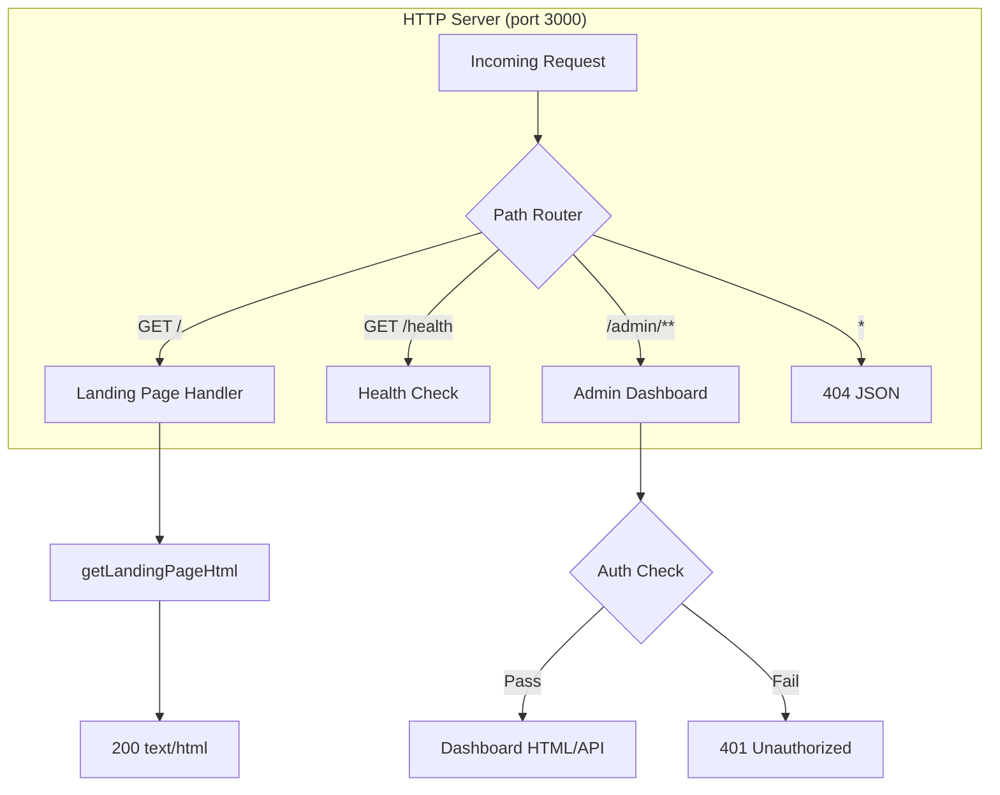

# Design Document: Clawd Landing Page

## Overview

This design introduces a public marketing landing page for Clawd — the consumer-facing brand of the NanoClaw cloud system. The page is served at the root path (`/`) of the orchestrator HTTP server, positioned before any authentication gate, and communicates Clawd's value proposition to working professionals in Singapore.

The landing page follows a "Premium Stationery" visual aesthetic: warm oatmeal backgrounds, chunky serif typography (Playfair Display), hand-drawn SVG doodle animations, and a single-column bullet-journal layout constrained to ~720px. It is implemented as a static HTML page with embedded CSS and vanilla JavaScript — no frontend framework, no build step beyond the existing TypeScript compilation.

### Key Design Decisions

1. **Inline HTML template literal** (same pattern as admin dashboard `html.ts`): The landing page HTML is exported from a TypeScript module as a template literal string. This avoids filesystem reads at runtime, keeps deployment as a single compiled JS bundle, and matches the established pattern in `src/cloud/admin-dashboard/html.ts`.

2. **Route insertion in the existing HTTP server**: The orchestrator's `createServer` callback in `src/index.ts` already handles `/health`, `/admin`, and 404. The landing page route (`GET /`) is added as the first check in this handler, before the admin dashboard delegation.

3. **No external asset files at runtime**: Fonts load from Google Fonts CDN. SVG illustrations and doodles are inlined in the HTML. Tailwind CSS (if used) comes via CDN `<link>`. This keeps total deployment artifact unchanged (single `dist/` folder).

4. **Separation from admin dashboard**: The landing page module lives in its own directory (`src/cloud/landing-page/`) parallel to `admin-dashboard/`, maintaining clean separation of concerns.

## Architecture



### Request Flow

1. HTTP request arrives at port 3000
2. Path router checks in order: `/` → `/health` → `/admin` → 404
3. For `GET /`: call `getLandingPageHtml()`, respond with `200 text/html`
4. No authentication required for the landing page
5. All other existing routes remain unchanged

## Components and Interfaces

### Module: `src/cloud/landing-page/index.ts`

The landing page module exports a single request handler function and an HTML generator.

```typescript
import http from 'node:http';

/**
 * Handle GET / requests by serving the landing page HTML.
 * Returns true if the request was handled, false otherwise.
 */
export function handleLandingPageRequest(
  req: http.IncomingMessage,
  res: http.ServerResponse,
): boolean;
```

### Module: `src/cloud/landing-page/html.ts`

Contains the full landing page as a template literal, following the same pattern as `src/cloud/admin-dashboard/html.ts`.

```typescript
/**
 * Returns the complete landing page HTML string.
 * Includes embedded CSS, inline SVGs, and vanilla JS for scroll animations.
 */
export function getLandingPageHtml(): string;
```

### Module: `src/cloud/landing-page/content.ts`

Centralizes all copy/content strings for easy editing without touching layout code.

```typescript
export interface FeatureItem {
  title: string;
  description: string;
  icon: string; // inline SVG string
}

export interface HowItWorksStep {
  number: number;
  title: string;
  description: string;
}

export interface PricingTier {
  name: string;
  price: string;
  description: string;
  features: string[];
  ctaLabel: string;
  ctaHref: string;
  highlighted?: boolean;
}

export const HERO_HEADLINE: string;
export const HERO_SUBHEADLINE: string;
export const HERO_CTA_LABEL: string;
export const WHATSAPP_LINK: string;
export const FEATURES: FeatureItem[];
export const HOW_IT_WORKS_STEPS: HowItWorksStep[];
export const PRICING_TIERS: PricingTier[];
export const FOOTER_LINKS: { label: string; href: string }[];
```

### Integration Point: `src/index.ts`

The HTTP server callback is modified to check for `GET /` before delegating to the admin dashboard:

```typescript
// In the createServer callback:
if (req.url === '/' && req.method === 'GET') {
  const { handleLandingPageRequest } = await import('./cloud/landing-page/index.js');
  handleLandingPageRequest(req, res);
  return;
}
```

## Data Models

This feature has no persistent data models. All content is static and compiled into the application bundle.

### Content Structure (compile-time)

| Entity | Fields | Notes |
|--------|--------|-------|
| FeatureItem | title, description, icon (SVG) | Exactly 4 items |
| HowItWorksStep | number, title, description | Exactly 3 steps, ordered |
| PricingTier | name, price, description, features[], ctaLabel, ctaHref, highlighted | 2 tiers: Free Trial, Pro |
| FooterLink | label, href | Privacy, Terms, section anchors |

### Design Tokens (CSS Custom Properties)

| Token | Value | Usage |
|-------|-------|-------|
| `--bg-oatmeal` | `#F5F0E8` | Page background |
| `--text-espresso` | `#3D2B1F` | Primary text |
| `--accent-mustard` | `#C4A35A` | CTAs, highlights, accents |
| `--font-heading` | `'Playfair Display', serif` | All headings |
| `--font-body` | `'Inter', sans-serif` | Body text |
| `--max-width` | `720px` | Content column constraint |

## Correctness Properties

*A property is a characteristic or behavior that should hold true across all valid executions of a system — essentially, a formal statement about what the system should do. Properties serve as the bridge between human-readable specifications and machine-verifiable correctness guarantees.*

Most acceptance criteria for this feature are specific content/structure checks (example-based tests) or visual design constraints (smoke tests). However, the routing logic has one meaningful universal property:

### Property 1: Unknown routes return 404

*For any* URL path string that does not exactly match `/`, `/health`, or start with `/admin`, the orchestrator SHALL respond with HTTP status 404 and a JSON body containing an `error` field.

**Validates: Requirements 1.5**

## Error Handling

### Route-Level Errors

| Scenario | Response | Status |
|----------|----------|--------|
| `GET /` — HTML generation fails | 500 Internal Server Error (JSON) | 500 |
| Unknown path | `{ "error": "Not found" }` | 404 |
| Non-GET method on `/` | Falls through to 404 handler | 404 |

### HTML Generation Errors

The `getLandingPageHtml()` function is a pure template literal with no I/O. It cannot fail at runtime. If a code error is introduced (e.g., undefined variable in template), it will fail at compile time (TypeScript) or throw a ReferenceError at module load time — both caught during development, not in production.

### Font Loading Failures

Google Fonts are loaded with `font-display: swap`. If the CDN is unreachable, the browser falls back to system serif/sans-serif fonts. The page remains fully readable and functional.

### Animation Failures

Scroll animations use `IntersectionObserver` with a feature check. If the browser doesn't support it (unlikely in modern browsers), animations simply don't trigger — the page remains static and fully usable. No JavaScript errors are thrown.

## Testing Strategy

### Unit Tests (Example-Based)

The majority of this feature's acceptance criteria are best validated with example-based unit tests that verify the HTML output of `getLandingPageHtml()`:

**HTML Structure Tests** (`src/cloud/landing-page/landing-page.test.ts`):

- Verify semantic elements exist: `<header>`, `<nav>`, `<main>`, `<section>`, `<footer>`
- Verify exactly one `<h1>` element
- Verify hero section contains headline with "Clawd", subheadline, and CTA
- Verify features section contains exactly 4 feature items with correct titles
- Verify "How It Works" section has 3 steps in correct order
- Verify pricing section has "Free Trial" and "Pro" tiers
- Verify footer contains Privacy Policy and Terms of Service links
- Verify Login link with `href="/admin"` exists in header/nav
- Verify viewport meta tag is set correctly
- Verify Open Graph meta tags are present
- Verify `<title>` contains "Clawd"

**CSS/Design Token Tests**:

- Verify background color `#F5F0E8` is present in CSS
- Verify text color `#3D2B1F` is present in CSS
- Verify accent color `#C4A35A` is present in CSS
- Verify max-width ~720px is set
- Verify media query for viewport < 768px exists
- Verify `font-display: swap` is present

**Route Handler Tests** (`src/cloud/landing-page/landing-page.test.ts`):

- `GET /` returns 200 with `Content-Type: text/html`
- `GET /` without auth headers returns 200 (no auth required)
- `POST /` is not handled (returns false)

**Performance Tests**:

- Verify HTML output byte length < 500KB

### Property-Based Tests

Using `fast-check` (already in devDependencies):

**Route 404 Property** (`src/cloud/landing-page/landing-page.test.ts`):

- Generate random URL path strings (excluding `/`, `/health`, `/admin*`)
- Verify all return 404 with JSON error body
- Minimum 100 iterations
- Tag: `Feature: clawd-landing-page, Property 1: Unknown routes return 404`

### Integration Tests

- Manual browser testing across viewport widths (320px–1440px)
- Visual verification of scroll animations
- Google Fonts loading with network throttling
- WhatsApp link opens correctly on mobile

### Test Configuration

- Framework: Vitest (existing project setup)
- PBT library: fast-check (already in `devDependencies`)
- Property tests: minimum 100 iterations per property
- Test file location: `src/cloud/landing-page/landing-page.test.ts`
