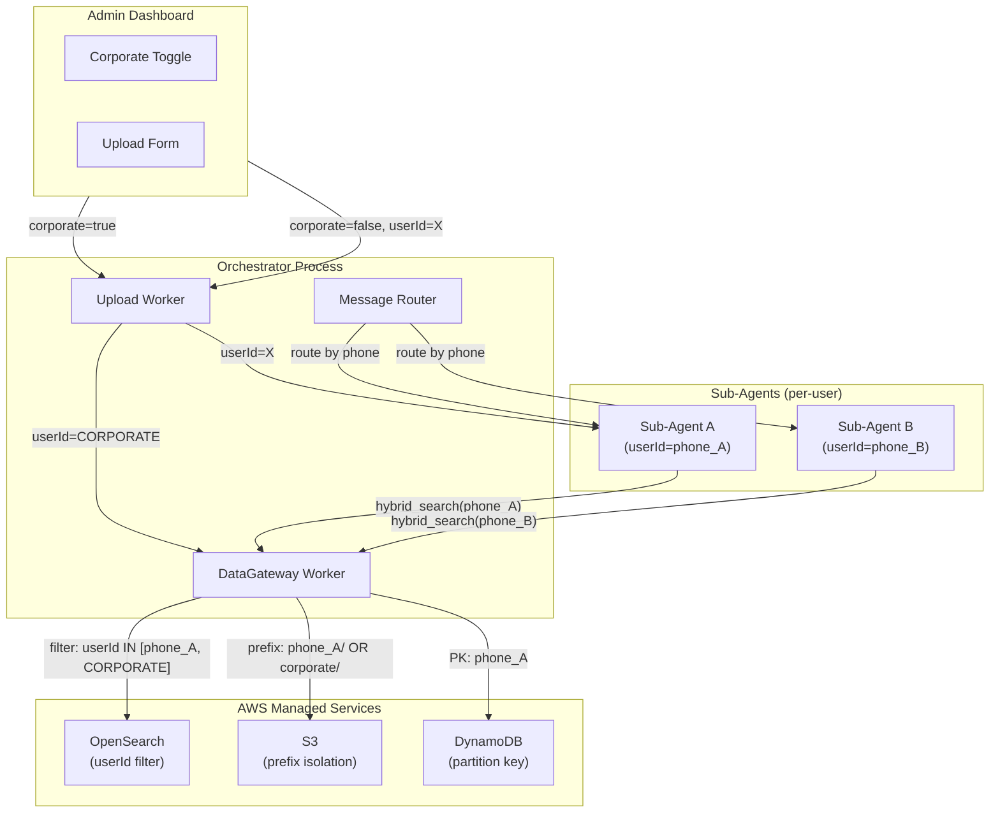
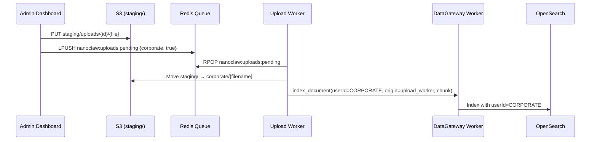

# Design Document: Data Isolation & Corporate Documents

## Overview

This design extends the existing NanoClaw DataGateway to support corporate documents — admin-uploaded files searchable by all users — while preserving strict per-user data isolation. The core change introduces a reserved `CORPORATE` sentinel userId that acts as a shared namespace for organization-wide documents, with hybrid search queries expanded to include both the requesting user's documents and corporate documents.

The design touches four system boundaries:

1. **DataGateway** — persistence layer gains corporate-aware search filters and sentinel protection
2. **DataGateway Worker** — request proxy gains origin validation for CORPORATE writes
3. **Upload Worker** — document dispatch gains corporate routing logic
4. **Admin Dashboard** — upload UI gains a corporate toggle with validation

### Design Rationale

The existing DataGateway already enforces userId-based isolation on every operation. Rather than introducing a separate "shared documents" index or a complex ACL system, we reuse the existing userId field with a well-known sentinel value (`'CORPORATE'`). This minimizes schema changes, keeps the OpenSearch index unified, and requires only a filter expansion in the search path.

---

## Architecture



### Key Architectural Decisions

| Decision | Choice | Rationale |
|----------|--------|-----------|
| Corporate document storage | Same OpenSearch index, `userId='CORPORATE'` | No schema migration, unified relevance scoring |
| S3 prefix for corporate | `corporate/` (not under any user) | Clear separation, no user can claim this prefix |
| Search filter expansion | `should` clause with `minimum_should_match: 1` | Standard OpenSearch pattern for OR filters |
| CORPORATE write authorization | Origin check in DataGateway Worker | Sub-agents cannot bypass; only Upload Worker can write CORPORATE |
| Corporate doc processing | Upload Worker indexes directly (no sub-agent) | No user container needed for shared docs |

---

## Components and Interfaces

### 1. DataGateway (Modified)

**File:** `src/cloud/data-gateway/index.ts`

#### New/Modified Methods

```typescript
interface IDataGateway {
    // MODIFIED: search now accepts optional includeCorporate flag
    hybridSearch(userId: string, query: string, vector: number[], topK: number): Promise<SearchResult[]>;

    // NEW: index with CORPORATE sentinel (restricted caller)
    indexCorporateDocument(chunk: DocumentChunk): Promise<void>;

    // MODIFIED: S3 operations gain corporate prefix awareness
    uploadFile(userId: string, bucket: string, key: string, stream: ReadableStream): Promise<string>;
    listFiles(userId: string, prefix: string): Promise<FileMetadata[]>;

    // MODIFIED: deleteAllUserData must NOT touch CORPORATE documents
    deleteAllUserData(userId: string): Promise<DeletionReceipt>;
}
```

#### Search Filter Change

The `hybridSearch` method's OpenSearch filter changes from:

```json
{ "filter": [{ "term": { "userId": "{user_id}" } }] }
```

To:

```json
{
    "filter": [{
        "bool": {
            "should": [
                { "term": { "userId": "{user_id}" } },
                { "term": { "userId": "CORPORATE" } }
            ],
            "minimum_should_match": 1
        }
    }]
}
```

#### Sentinel Protection

```typescript
// New constant
static readonly CORPORATE_SENTINEL = 'CORPORATE';

// Modified assertUserId — rejects CORPORATE from normal callers
private assertUserId(userId: string): void {
    if (!userId || typeof userId !== 'string' || userId.trim().length === 0) {
        throw new Error('DataGateway: userId is required');
    }
    if (userId === DataGateway.CORPORATE_SENTINEL) {
        throw new Error('DataGateway: CORPORATE sentinel cannot be used as a regular userId');
    }
}

// New method — bypasses assertUserId, only callable internally
async indexCorporateDocument(chunk: DocumentChunk): Promise<void> {
    // Indexes with userId = 'CORPORATE'
}
```

#### S3 Key Validation Change

```typescript
private assertKeyBelongsToUser(userId: string, key: string): void {
    if (key.includes('../') || key.includes('..\\')) {
        throw new Error('DataGateway: path traversal detected');
    }
    const expectedPrefix = `${userId}/`;
    const corporatePrefix = 'corporate/';
    // Allow corporate/ prefix for read operations (getFile, listFiles)
    if (!key.startsWith(expectedPrefix) && !key.startsWith(corporatePrefix)) {
        throw new Error(`DataGateway: key does not belong to user or corporate namespace`);
    }
}
```

### 2. DataGateway Worker (Modified)

**File:** `src/cloud/data-gateway-worker/index.ts`

#### Changes

- **`index_document` handler**: Validates that if `userId === 'CORPORATE'`, the request must carry an `origin: 'upload_worker'` field. Sub-agent requests with `userId = 'CORPORATE'` are rejected and logged as security violations.
- **`hybrid_search` handler**: No change needed — the DataGateway's `hybridSearch` method handles the corporate filter internally.

```typescript
async function handleIndexDocument(services: CloudServices, userId: string, request: Record<string, unknown>): Promise<void> {
    const chunk = request.chunk as DocumentChunk;
    const origin = request.origin as string | undefined;

    if (userId === 'CORPORATE') {
        if (origin !== 'upload_worker') {
            log.error('SECURITY: Unauthorized CORPORATE index attempt', { origin, userId });
            throw new Error('CORPORATE indexing restricted to upload_worker');
        }
        await services.dataGateway.indexCorporateDocument(chunk);
    } else {
        await services.dataGateway.indexDocument(userId, chunk);
    }
}
```

### 3. Upload Worker (Modified)

**File:** `src/cloud/upload-worker/index.ts`

#### Changes

- Reads `corporate` flag from upload metadata
- When `corporate === true`: indexes directly via DataGateway Worker with `userId = 'CORPORATE'` and `origin = 'upload_worker'`
- When `corporate === false`: dispatches to the target user's sub-agent queue (existing behavior)
- S3 key uses `corporate/` prefix for corporate uploads

```typescript
interface PendingUpload {
    uploadId: string;
    filename: string;
    contentType: string;
    s3Key: string;
    bucket: string;
    timestamp: string;
    userId?: string;
    corporate?: boolean;  // NEW: corporate flag from admin dashboard
}
```

#### Corporate Upload Flow



### 4. Admin Dashboard (Modified)

**File:** `src/cloud/admin-dashboard/index.ts`

#### Changes

- Upload form gains a "Make available to all users" toggle (default: OFF)
- When toggle ON: sets `userId = 'CORPORATE'` and `s3Key = corporate/...` in upload metadata
- When toggle OFF: requires user selection, sets `userId` to selected user
- Validation: toggle OFF + no user selected = 400 error

```typescript
// In uploadToS3AndEnqueue:
const isCorporate = formFields.corporate === 'true';
const targetUserId = isCorporate ? 'CORPORATE' : formFields.targetUserId;

if (!isCorporate && !targetUserId) {
    throw new Error('User selection required when corporate toggle is disabled');
}

await services.redis.lpush('nanoclaw:uploads:pending', JSON.stringify({
    uploadId,
    filename: file.filename,
    contentType: file.contentType,
    s3Key: isCorporate ? `corporate/${uploadId}/${file.filename}` : `staging/uploads/${uploadId}/${file.filename}`,
    bucket,
    userId: targetUserId,
    corporate: isCorporate,
    timestamp: new Date().toISOString(),
}));
```

### 5. Orchestrator / Message Router (Unchanged)

The existing router already enforces message routing isolation:

- Messages are routed by sender phone number → userId mapping
- Each Sub-Agent receives only messages from its assigned user
- The `userId` is resolved via `senderResolver` and fixed at container startup

No changes needed — the router's existing isolation is sufficient.

---

## Data Models

### OpenSearch Document Schema (Unchanged)

```json
{
    "id": "keyword",
    "userId": "keyword",
    "docType": "keyword",
    "content": "text",
    "contentVector": "knn_vector (1536, cosinesimil, nmslib)",
    "filename": "keyword",
    "pageNumber": "integer",
    "chunkIndex": "integer",
    "uploadedAt": "date"
}
```

Corporate documents use `userId = 'CORPORATE'` — no schema change required.

### S3 Key Structure

| Document Type | Key Pattern | Example |
|---------------|-------------|---------|
| User document | `{userId}/documents/{filename}` | `6281234567890/documents/report.pdf` |
| Corporate document | `corporate/{uploadId}/{filename}` | `corporate/abc123/handbook.pdf` |
| Staging (any) | `staging/uploads/{uploadId}/{filename}` | `staging/uploads/xyz/file.docx` |

### DynamoDB Tables (Unchanged)

Chat history and preferences remain strictly per-user (partition key = userId). Corporate documents do not use DynamoDB — they exist only in OpenSearch (for search) and S3 (for storage).

### Upload Metadata (Redis Queue Message)

```typescript
interface PendingUpload {
    uploadId: string;
    filename: string;
    contentType: string;
    s3Key: string;
    bucket: string;
    timestamp: string;
    userId: string;          // 'CORPORATE' or user phone number
    corporate: boolean;      // explicit flag for routing logic
}
```

### Security Invariants

| Invariant | Enforcement Point |
|-----------|-------------------|
| User A cannot read User B's documents | DataGateway `hybridSearch` filter: `userId IN [A, CORPORATE]` |
| User A cannot read User B's chat history | DynamoDB partition key = userId |
| User A cannot access User B's S3 files | `assertKeyBelongsToUser` prefix check |
| Sub-agents cannot write CORPORATE docs | DataGateway Worker origin validation |
| CORPORATE cannot be assigned to real users | `assertUserId` rejects CORPORATE sentinel |
| PDPA deletion does not affect corporate docs | `deleteAllUserData` filters by user's userId only |

---

## Correctness Properties

*A property is a characteristic or behavior that should hold true across all valid executions of a system — essentially, a formal statement about what the system should do. Properties serve as the bridge between human-readable specifications and machine-verifiable correctness guarantees.*

### Property 1: userId validation rejects all invalid inputs

*For any* string that is empty, whitespace-only, or undefined, calling any public DataGateway method with that value as the userId parameter SHALL throw an error before performing any persistence operation.

**Validates: Requirements 1.4, 4.3, 8.1**

### Property 2: Hybrid search includes corporate-inclusive filter on both sub-queries

*For any* valid userId (not empty, not CORPORATE), calling `hybridSearch` SHALL produce exactly two OpenSearch queries (kNN and BM25), each containing a filter with a `bool.should` clause matching both the user's userId and `'CORPORATE'` with `minimum_should_match: 1`.

**Validates: Requirements 2.1, 2.2, 2.4, 3.1**

### Property 3: Corporate uploads use CORPORATE sentinel and corporate/ prefix

*For any* upload metadata where `corporate === true`, the Upload Worker SHALL index all chunks with `userId = 'CORPORATE'` and store the file under an S3 key starting with `corporate/`.

**Validates: Requirements 1.1, 1.2, 6.2**

### Property 4: Non-corporate uploads preserve the specified target userId

*For any* upload metadata where `corporate === false` and a valid target userId is specified, the Upload Worker SHALL index chunks with that exact userId and store the file under an S3 key starting with `{userId}/`.

**Validates: Requirements 1.3, 6.3**

### Property 5: S3 operations reject keys outside user or corporate namespace

*For any* userId A and any S3 key that does not start with `{A}/` or `corporate/`, calling `uploadFile`, `getFile`, or `deleteFile` with that key SHALL throw a data isolation error. Additionally, keys containing path traversal sequences (`../`) SHALL always be rejected regardless of prefix.

**Validates: Requirements 3.2, 3.4**

### Property 6: CORPORATE sentinel is protected from unauthorized use

*For any* request to `indexDocument` where `userId = 'CORPORATE'` and the request origin is not `'upload_worker'`, the DataGateway Worker SHALL reject the request. Additionally, calling any standard DataGateway public method (getChatHistory, putChatMessage, etc.) with `userId = 'CORPORATE'` SHALL throw an error.

**Validates: Requirements 7.1, 7.2, 7.3**

### Property 7: PDPA deletion excludes CORPORATE documents

*For any* valid userId, calling `deleteAllUserData` SHALL issue an OpenSearch `deleteByQuery` with a filter targeting only that userId, and SHALL NOT include `'CORPORATE'` in the deletion filter.

**Validates: Requirements 8.2**

### Property 8: Message routing targets the correct per-user queue

*For any* sender phone number that resolves to a userId, the Orchestrator SHALL enqueue the message to the Redis key `queue:agent:{userId}:inbound` and SHALL NOT enqueue to any other user's queue key.

**Validates: Requirements 5.1**

---

## Error Handling

### DataGateway Errors

| Error Condition | Behavior | Response |
|-----------------|----------|----------|
| Empty/undefined userId | Throw synchronously before any I/O | N/A (internal) |
| userId = 'CORPORATE' on normal method | Throw synchronously | N/A (internal) |
| CORPORATE index without upload_worker origin | Reject + log security violation | Error response on Redis |
| S3 key prefix mismatch | Throw synchronously | N/A (internal) |
| Path traversal in S3 key | Throw synchronously | N/A (internal) |
| OpenSearch query failure | Propagate error, log to CloudWatch | Error response on Redis |
| DynamoDB throttling | AWS SDK auto-retry (exponential backoff) | Transparent |

### Upload Worker Errors

| Error Condition | Behavior |
|-----------------|----------|
| Missing corporate flag + missing userId | Reject upload, return 400 to dashboard |
| S3 staging upload failure | Move to DLQ, retry up to 3 times |
| DataGateway Worker rejection | Log error, mark upload as failed |
| Redis enqueue failure | Log error, upload remains in S3 staging |

### Admin Dashboard Errors

| Error Condition | Behavior |
|-----------------|----------|
| Toggle OFF + no user selected | 400 validation error, prevent submission |
| File exceeds 50MB | 400 error before S3 upload |
| Authentication failure | 401 + rate limit tracking |

### Security Violation Logging

All security violations are logged as structured JSON to stdout (CloudWatch pickup):

```typescript
interface SecurityViolationLog {
    level: 'error';
    event: 'security_violation';
    type: 'corporate_sentinel_abuse' | 'cross_user_access' | 'path_traversal';
    userId: string;
    origin: string;
    action: string;
    timestamp: string; // ISO 8601
}
```

---

## Testing Strategy

### Property-Based Tests (fast-check, minimum 100 iterations each)

The following property-based tests validate the correctness properties defined above. Each test uses `fast-check` (already a project dependency) with Vitest.

| Property | Test File | What Varies |
|----------|-----------|-------------|
| P1: userId validation | `data-gateway/property-tests/corporate-isolation.property.test.ts` | Empty strings, whitespace, undefined, null |
| P2: Corporate search filter | `data-gateway/property-tests/corporate-isolation.property.test.ts` | Random valid userIds |
| P3: Corporate upload routing | `upload-worker/property-tests/corporate-upload.property.test.ts` | Random filenames, upload metadata |
| P4: User upload routing | `upload-worker/property-tests/corporate-upload.property.test.ts` | Random userIds, filenames |
| P5: S3 key validation | `data-gateway/property-tests/corporate-isolation.property.test.ts` | Random userIds, random keys |
| P6: CORPORATE sentinel protection | `data-gateway/property-tests/corporate-isolation.property.test.ts` | Random origins, all public methods |
| P7: PDPA deletion scope | `data-gateway/property-tests/corporate-isolation.property.test.ts` | Random userIds |
| P8: Message routing | `router/property-tests/routing-isolation.property.test.ts` | Random phone numbers |

**Configuration:**

- Library: `fast-check` v4.8.0 (already in devDependencies)
- Runner: `vitest` v4.0.18
- Iterations: 100 per property (configurable via `{ numRuns: 100 }`)
- Tag format: `Feature: data-isolation-corporate-docs, Property {N}: {title}`

### Unit Tests (Example-Based)

| Test | Validates |
|------|-----------|
| Admin dashboard HTML contains corporate toggle | Req 6.1 |
| Toggle defaults to disabled | Req 6.4 |
| Unrecognized sender is not routed | Req 5.5 |
| Corporate docs appear in search results alongside user docs | Req 2.3 |
| Router strips other users' content from context | Req 5.2, 5.3 |

### Integration Tests

| Test | Validates |
|------|-----------|
| End-to-end corporate upload → search inclusion | Req 1.1, 2.1 |
| PDPA deletion leaves corporate docs intact | Req 8.2 |
| Sub-agent container has no direct AWS access | Req 8.3 |
| Container userId is immutable during lifetime | Req 8.4 |
