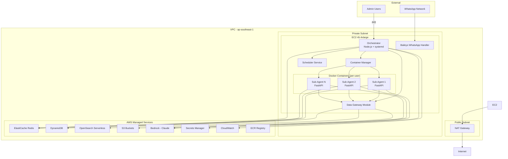

# Design: NanoClaw AWS Deployment

## Overview

This design describes the cloud deployment of NanoClaw v2 (WhatsApp AI assistant) to AWS infrastructure in ap-southeast-1 (Singapore). The system migrates from a local development setup to a production-grade cloud deployment using a Monolithic Orchestrator + Isolated Agents architecture with an internal Data Gateway module for centralized data isolation enforcement.

The deployment preserves the existing NanoClaw v2 message-passing architecture (host ↔ container via session DBs) while replacing local storage backends with managed AWS services: DynamoDB for structured data, OpenSearch Serverless for vector search, S3 for object storage, ElastiCache Redis for message queuing, and Bedrock for LLM inference.

Key design decisions:

- Single EC2 instance (r6i.4xlarge) running the orchestrator with per-user Docker containers
- Data Gateway as an internal TypeScript module (not a separate service) to enforce userId isolation on all persistence operations without adding network hops
- Terraform for all infrastructure definitions with GitHub Actions CI/CD
- Vertical scaling path (r6i.4xlarge → r6i.8xlarge) covering the 50-user target capacity

## Architecture

### System Architecture Diagram



### Component Breakdown

Based on the architecture selection, the system consists of these components:

| Component | Runtime | Responsibility |
|-----------|---------|----------------|
| **Orchestrator** | Node.js on EC2 (systemd) | Message routing, container lifecycle, scheduling, WhatsApp bridge (Baileys), admin API, rate limiting |
| **Data Gateway** | Internal TypeScript module | Centralized data access — enforces userId isolation on ALL queries, audit logging, sensitive data redaction |
| **Sub-Agent Container** | FastAPI per user (Docker) | Message processing, Bedrock LLM calls, RAG context assembly, slide generation, document ingestion |
| **ElastiCache Redis** | AWS Managed | Async message passing between orchestrator and sub-agents, dead letter queue |
| **DynamoDB** | AWS Managed | Chat history, user preferences, webhook tokens, system errors (with TTL) |
| **OpenSearch Serverless** | AWS Managed | Vector similarity search + BM25 keyword search for RAG |
| **S3** | AWS Managed | Document files, generated PPTX, WhatsApp session backup |
| **Secrets Manager** | AWS Managed | All credentials with 90-day rotation |
| **CloudWatch** | AWS Managed | Metrics, structured JSON logs, alerts, dashboards |
| **ECR** | AWS Managed | Container image registry (orchestrator + agent images) |

### Information Flow

1. **Inbound message**: WhatsApp → Baileys handler → Orchestrator → Redis queue → Sub-Agent container
2. **Data operations**: Sub-Agent → Data Gateway module → {DynamoDB, OpenSearch, S3} (userId filter injected)
3. **LLM inference**: Sub-Agent → Bedrock (Claude 3.5 Sonnet) → Sub-Agent
4. **Outbound message**: Sub-Agent → Redis queue → Orchestrator → Baileys → WhatsApp
5. **Monitoring**: All components → CloudWatch (metrics + structured logs)
6. **Secrets**: EC2 IAM role → Secrets Manager SDK → runtime injection

### Key Design-Induced Invariants

1. **Data Gateway is the sole path to persistence** — Sub-agents cannot directly access DynamoDB, OpenSearch, or S3. All data operations route through the Data Gateway which injects userId filters and logs access.
2. **One container per user, one user per container** — The orchestrator enforces a 1:1 mapping.
3. **Redis is the only communication channel** — Orchestrator and sub-agents communicate exclusively via Redis queues.
4. **Secrets are runtime-injected via IAM** — No secrets in environment variables, Docker labels, or configuration files.

## Components and Interfaces

### Orchestrator

The orchestrator is the existing NanoClaw v2 host process adapted for AWS. It runs as a systemd service with automatic restart.

```typescript
interface Orchestrator {
  // WhatsApp handling
  initBaileys(sessionStore: S3SessionStore): Promise<void>;
  handleInboundMessage(msg: WhatsAppMessage): Promise<void>;
  deliverOutboundMessage(msg: OutboundMessage): Promise<void>;

  // Container lifecycle
  spawnContainer(userId: string): Promise<ContainerInfo>;
  killContainer(userId: string): Promise<void>;
  monitorContainers(): void;

  // Scheduling
  scheduleNotification(userId: string, cron: string, payload: NotificationPayload): void;
  runScheduledTasks(): Promise<void>;

  // Rate limiting
  checkRateLimit(userId: string): RateLimitResult;

  // Health
  getHealthStatus(): HealthStatus;
}
```

### Data Gateway Module

Internal module that wraps all persistence operations. Every query passes through here for userId injection.

```typescript
interface DataGateway {
  // DynamoDB operations
  putChatMessage(userId: string, message: ChatMessage): Promise<void>;
  getChatHistory(userId: string, limit: number): Promise<ChatMessage[]>;
  putUserPreference(userId: string, prefs: UserPreferences): Promise<void>;
  getUserPreference(userId: string): Promise<UserPreferences | null>;
  createWebhookToken(userId: string, tokenHash: string): Promise<void>;
  validateWebhookToken(tokenHash: string): Promise<TokenValidation>;

  // OpenSearch operations
  indexDocument(userId: string, chunk: DocumentChunk): Promise<void>;
  hybridSearch(userId: string, query: string, vector: number[], topK: number): Promise<SearchResult[]>;
  deleteUserDocuments(userId: string, filename?: string): Promise<void>;

  // S3 operations
  uploadFile(userId: string, bucket: string, key: string, stream: ReadableStream): Promise<string>;
  getFile(userId: string, bucket: string, key: string): Promise<ReadableStream>;
  listFiles(userId: string, prefix: string): Promise<FileMetadata[]>;
  deleteFile(userId: string, bucket: string, key: string): Promise<void>;

  // Audit
  logAccess(userId: string, operation: string, resource: string): void;

  // PDPA compliance
  exportUserData(userId: string): Promise<UserDataExport>;
  deleteAllUserData(userId: string): Promise<DeletionReceipt>;
}
```

### Sub-Agent Container

FastAPI application running inside each user's Docker container.

```typescript
interface SubAgent {
  // Message processing
  processMessage(message: InboundMessage): Promise<AgentResponse>;

  // RAG pipeline
  ingestDocument(file: UploadedFile): Promise<IngestionResult>;
  queryKnowledge(query: string, conversationHistory: Message[]): Promise<RAGResponse>;

  // Document management
  listDocuments(): Promise<DocumentInfo[]>;
  deleteDocument(filename: string): Promise<void>;
  updateDocument(filename: string): Promise<IngestionResult>;

  // Slide generation
  generateSlides(summary: string, template: SlideTemplate): Promise<SlideResult>;

  // LLM communication
  callBedrock(prompt: BedrockPrompt): Promise<BedrockResponse>;
}
```

### Redis Queue Interface

```typescript
interface MessageQueue {
  // Orchestrator → Sub-Agent
  enqueueForAgent(userId: string, message: QueueMessage): Promise<void>;
  dequeueForAgent(userId: string, timeout: number): Promise<QueueMessage | null>;

  // Sub-Agent → Orchestrator
  enqueueResponse(userId: string, response: AgentResponse): Promise<void>;
  dequeueResponse(timeout: number): Promise<AgentResponse | null>;

  // Dead letter queue
  moveToDLQ(message: QueueMessage, error: string): Promise<void>;
  retryFromDLQ(): Promise<number>;

  // Backpressure
  getQueueDepth(userId: string): Promise<number>;
  isBackpressured(userId: string): Promise<boolean>;
}
```

### Container Manager

```typescript
interface ContainerManager {
  spawn(userId: string, config: ContainerConfig): Promise<ContainerInfo>;
  kill(userId: string): Promise<void>;
  getStatus(userId: string): ContainerStatus;
  listActive(): ContainerInfo[];
  enforceResourceLimits(userId: string): void;
}

interface ContainerConfig {
  memoryLimit: '512m';
  cpuQuota: 50000;  // 50% single core
  pidsLimit: 100;
  diskQuota: '2g';
  readOnlyRootfs: true;
  dropCapabilities: 'ALL';
  seccompProfile: string;
  networkNamespace: string;
  uid: 1000;
}
```

## Data Models

### DynamoDB Tables

#### chat_messages

| Attribute | Type | Key | Description |
|-----------|------|-----|-------------|
| userId | String | Partition Key | User identifier |
| timestamp | String (ISO 8601) | Sort Key | Message timestamp |
| messageId | String | — | Unique message ID |
| role | String | — | 'user' or 'assistant' |
| content | String | — | Message text content |
| metadata | Map | — | Attachments, source info |
| ttl | Number | — | TTL epoch (90 days from creation) |

#### webhook_tokens

| Attribute | Type | Key | Description |
|-----------|------|-----|-------------|
| tokenHash | String | Partition Key | SHA-256 hash of token |
| userId | String | — | Owning user |
| createdAt | String | — | Creation timestamp |
| ttl | Number | — | TTL epoch (15 minutes from creation) |

#### user_preferences

| Attribute | Type | Key | Description |
|-----------|------|-----|-------------|
| userId | String | Partition Key | User identifier |
| autoSave | Boolean | — | Auto-save mode toggle |
| notificationTime | String | — | Daily notification time (HH:MM) |
| slideTemplate | String | — | Preferred slide template |
| consentGiven | Boolean | — | PDPA consent flag |
| consentTimestamp | String | — | When consent was given |

#### system_errors

| Attribute | Type | Key | Description |
|-----------|------|-----|-------------|
| userId | String | Partition Key | User or 'system' |
| timestamp | String | Sort Key | Error timestamp |
| errorType | String | — | Error classification |
| message | String | — | Error message (redacted) |
| stackTrace | String | — | Stack trace (redacted) |
| ttl | Number | — | TTL epoch (30 days from creation) |

### OpenSearch Serverless Index

#### documents index

```json
{
  "mappings": {
    "properties": {
      "id": { "type": "keyword" },
      "userId": { "type": "keyword" },
      "docType": { "type": "keyword" },
      "content": { "type": "text", "analyzer": "standard" },
      "contentVector": {
        "type": "knn_vector",
        "dimension": 1536,
        "method": {
          "name": "hnsw",
          "space_type": "cosinesimil",
          "engine": "nmslib"
        }
      },
      "filename": { "type": "keyword" },
      "pageNumber": { "type": "integer" },
      "chunkIndex": { "type": "integer" },
      "uploadedAt": { "type": "date" }
    }
  }
}
```

### S3 Bucket Structure

```
nanoclaw-data-{account-id}/
├── staging/{userId}/{uploadId}/{filename}     # Pending malware scan
├── documents/{userId}/{filename}/{chunkId}    # Processed documents
├── corporate/{filename}                       # Shared corporate docs
├── sessions/{sessionId}/auth_state.json       # Baileys session persistence
├── slides/{userId}/{timestamp}/{filename}.pptx # Generated presentations
└── exports/{userId}/{requestId}/              # PDPA data exports
```

### Redis Data Structures

```
# Message queues (Lists)
queue:agent:{userId}:inbound    # Orchestrator → Sub-Agent messages
queue:orchestrator:responses     # Sub-Agent → Orchestrator responses
queue:dlq:{userId}              # Dead letter queue per user

# Rate limiting (Sorted Sets)
ratelimit:user:{userId}:minute  # Messages in current minute window
ratelimit:global:hour           # Global hourly message count

# Container state (Hashes)
container:{userId}              # { status, startedAt, lastActivity, pid }

# Session state (Strings with TTL)
session:whatsapp:health         # Last health check timestamp
```

## Correctness Properties

*A property is a characteristic or behavior that should hold true across all valid executions of a system — essentially, a formal statement about what the system should do. Properties serve as the bridge between human-readable specifications and machine-verifiable correctness guarantees.*

### Property 1: Data isolation enforcement

*For any* two distinct user IDs (userA, userB) and any data stored by userB across any persistence layer (DynamoDB, OpenSearch, S3), all queries executed through the Data Gateway as userA SHALL return zero results belonging to userB.

**Validates: Requirements 7.1, AC-5**

### Property 2: TTL epoch calculation

*For any* chat message with any valid creation timestamp, the computed TTL attribute SHALL equal the creation timestamp (in epoch seconds) plus exactly 7,776,000 seconds (90 days). For webhook tokens, TTL SHALL equal creation timestamp plus 900 seconds (15 minutes). For system errors, TTL SHALL equal creation timestamp plus 2,592,000 seconds (30 days).

**Validates: Requirements 2.1**

### Property 3: Document chunking invariants

*For any* input text of length > 0, the recursive character splitter SHALL produce chunks where: (1) every chunk contains at most 512 tokens, (2) consecutive chunks overlap by approximately 50 tokens (±5 tolerance), and (3) concatenating all chunks with overlap removal reconstructs the original text without loss.

**Validates: Requirements 3.2**

### Property 4: Hybrid retrieval score combination

*For any* set of candidate search results with vector similarity scores in [0,1] and BM25 scores ≥ 0, the combined score SHALL equal 0.7 × vector_score + 0.3 × normalized_bm25_score, results SHALL be ordered by combined score descending, and exactly min(3, total_candidates) results SHALL be returned.

**Validates: Requirements 3.3**

### Property 5: Rate limiting enforcement

*For any* sequence of messages from a single user within a 1-minute window, the rate limiter SHALL allow the first 20 messages and reject all subsequent messages. *For any* sequence of messages across all users within a 1-hour window, the rate limiter SHALL allow the first 200 messages and reject all subsequent messages.

**Validates: Requirements 4.1**

### Property 6: Webhook token lifecycle

*For any* generated webhook token: (1) creating the token and validating its SHA-256 hash within 15 minutes SHALL succeed, (2) validating the same token hash a second time SHALL fail (one-time use), and (3) validating any token hash after 15 minutes from creation SHALL fail (expiry).

**Validates: Requirements 5.2**

### Property 7: Log redaction completeness

*For any* log string containing sensitive patterns (strings matching API key formats, bearer tokens, password fields, or message content fields), the redaction function SHALL replace all sensitive values with a mask placeholder while preserving the non-sensitive structure of the log entry.

**Validates: Requirements 6.2**

### Property 8: PDPA data lifecycle

*For any* user with data stored across all persistence layers, (1) the export function SHALL return a complete dataset containing all records from DynamoDB, all indexed documents from OpenSearch, and all files from S3 belonging to that user, and (2) after the delete function completes, all queries for that user across all stores SHALL return empty results.

**Validates: Requirements 7.3**

## Error Handling

### Circuit Breaker Pattern (LLM API)

The Bedrock client implements a circuit breaker with three states:

- **Closed** (normal): Requests pass through. Track failure count.
- **Open** (tripped): After 5 consecutive failures or >50% failure rate in 60s window, reject all requests immediately with a cached fallback response ("I'm temporarily unable to process your request").
- **Half-Open** (recovery): After 30s cooldown, allow one probe request. If it succeeds, close the circuit. If it fails, reopen.

### Retry Strategy

| Operation | Max Retries | Backoff | Notes |
|-----------|-------------|---------|-------|
| Bedrock LLM call | 3 | Exponential (1s, 2s, 4s) | Circuit breaker wraps retries |
| Bedrock Embedding | 5 | Exponential (1s, 2s, 4s, 8s, 16s) | Batch of 50 chunks per call |
| DynamoDB write | 3 | Exponential (100ms, 200ms, 400ms) | SDK built-in retry |
| OpenSearch query | 3 | Exponential (200ms, 400ms, 800ms) | — |
| S3 upload | 3 | Exponential (1s, 2s, 4s) | Multipart for files > 5MB |
| Redis enqueue | 2 | Fixed 500ms | Move to DLQ after failure |
| Container spawn | 2 | Fixed 5s | Alert on second failure |

### Dead Letter Queue

Failed messages (after 3 Redis delivery attempts) are moved to a per-user DLQ in Redis. A background job retries DLQ messages every 6 hours. After 3 DLQ retry cycles (18 hours total), messages are logged to CloudWatch as permanently failed and an alert is triggered.

### Container Failure Recovery

| Failure Type | Detection | Recovery |
|--------------|-----------|----------|
| OOM kill (exit 137) | Docker event listener | Log to CloudWatch, alert, respawn with same config |
| Process crash | Health check timeout (30s) | Increment failure counter, respawn with backoff |
| Repeated crashes (>3 in 5min) | Failure counter | Stop respawning, alert admin, quarantine user queue |
| Disk quota exceeded | Docker event | Kill container, clear temp files, respawn |
| Network timeout | Health check | Restart container networking namespace |

### Graceful Degradation

- **Bedrock unavailable**: Return cached "service temporarily unavailable" message, queue message for retry
- **OpenSearch unavailable**: Fall back to DynamoDB-only responses (no RAG), inform user
- **Redis unavailable**: Orchestrator processes messages synchronously (bypass queue), reduced throughput
- **S3 unavailable**: Reject file uploads with user-friendly error, existing indexed documents still queryable via OpenSearch

## Testing Strategy

### Unit Tests

Unit tests cover individual component logic using vitest (host/orchestrator) and pytest (sub-agent FastAPI):

- **Data Gateway**: Verify userId injection on all query builders, test audit logging, test redaction logic
- **Rate Limiter**: Test window calculations, boundary conditions, counter reset
- **Document Chunker**: Test splitting logic with various document sizes and formats
- **Score Combiner**: Test hybrid score calculation, normalization, top-K selection
- **Webhook Token Manager**: Test hash generation, validation, expiry logic
- **Container Config Builder**: Test Docker flag generation from ContainerConfig interface
- **Log Redactor**: Test pattern matching and masking across all sensitive data types

Target: 80% code coverage (REQ-8.2).

### Property-Based Tests

Property-based tests validate the correctness properties defined above using **fast-check** (TypeScript) for the orchestrator/Data Gateway and **Hypothesis** (Python) for the sub-agent.

Configuration:

- Minimum 100 iterations per property test
- Each test tagged with: `Feature: nanoclaw-aws-deployment, Property {N}: {title}`
- Generators produce realistic data (valid user IDs, document text, score ranges, timestamps)

| Property | Library | Component Under Test |
|----------|---------|---------------------|
| 1: Data isolation | fast-check | Data Gateway module (mocked AWS clients) |
| 2: TTL calculation | fast-check | Data Gateway DynamoDB writer |
| 3: Chunking invariants | Hypothesis | Sub-Agent document processor |
| 4: Score combination | Hypothesis | Sub-Agent RAG retrieval |
| 5: Rate limiting | fast-check | Orchestrator rate limiter |
| 6: Token lifecycle | fast-check | Orchestrator webhook token manager |
| 7: Log redaction | fast-check | Shared logging module |
| 8: PDPA lifecycle | fast-check | Data Gateway (mocked AWS clients) |

### Integration Tests

Integration tests verify cross-component behavior with real (or localstack) AWS services:

- **End-to-end message flow** (AC-1): Send message via mock WhatsApp client → verify response arrives
- **Document pipeline** (AC-2): Upload file → verify chunks in OpenSearch → query returns relevant results
- **Notification delivery** (AC-3): Configure schedule → advance time → verify notification sent
- **Slide generation** (AC-4): Submit summary → verify valid PPTX in S3 → verify delivery
- **Container recovery** (AC-6): Kill container → verify automatic restart within 30s
- **Terraform deployment** (AC-7): `terraform plan` in CI, `terraform apply` in staging environment

### Infrastructure Tests

- **Terraform validate**: Syntax and configuration validation in CI
- **Terraform plan**: Drift detection on every PR
- **Security scanning**: tfsec/checkov for misconfigurations (open security groups, unencrypted resources)
- **Smoke tests post-deploy**: Health endpoint responds, DynamoDB tables accessible, OpenSearch collection reachable

### Load Testing

- **Tool**: k6 or Artillery
- **Scenario**: 50 concurrent simulated users sending messages at peak rate
- **Assertions**: P95 latency ≤ 30s, zero cross-user data leakage, no container OOM kills
- **Frequency**: Before production promotion (part of CI/CD pipeline)
