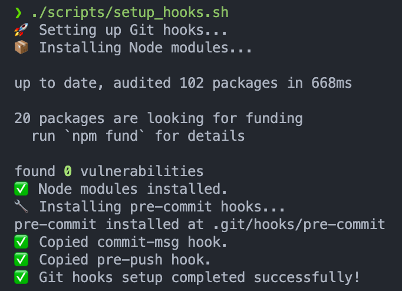

# PocketClaw — Personal AI Assistant

Local-first personal assistant built on top of [NanoClaw v2](https://github.com/nanocoai/nanoclaw). Talks to you via Telegram + WhatsApp with shared memory across both, ingests email / calendar / contacts from Google / Microsoft / Apple, processes photos via local vision, and generates an Obsidian wiki you can sync peer-to-peer with Syncthing.

**Why local-first?** Only the final assembled prompt to Anthropic's API ever leaves your machine. Emails, photos, contacts, and files stay in `~/.pocketclaw/`.

## Quick Links

- [SETUP.md](docs/SETUP.md) — clone-to-first-message walkthrough
- [POCKETCLAW.md](docs/POCKETCLAW.md) — PocketClaw-specific architecture
- [ARCHITECTURE.md](docs/ARCHITECTURE.md) — underlying NanoClaw architecture
- [PRD.md](PRD.md) — full product spec v3.0
- [CONTRIBUTING.md](CONTRIBUTING.md) — branch naming, commit format, PR flow

## Slash Commands (in Telegram / WhatsApp)

| Command | What it does |
|---------|--------------|
| `/memory <fact>` | Save a fact to mnemon |
| `/recall <query>` | Search mnemon graph |
| `/wiki <topic>` | Regenerate Obsidian wiki entry |
| `/ingest` | Trigger immediate cloud ingestion |
| `/status` | Show entity count, last ingest time, watcher health |
| `/digest` | Send morning digest now (auto-fires at 07:00) |
| `/audit [date]` | Show audit log entries for a date |
| `/auth google\|microsoft\|apple` | Start OAuth / device-code flow |
| `/photo <description>` | Manually save a photo description |

## Project Structure

This repo is two things stacked:

1. **NanoClaw v2** harness — `src/`, `container/`, `groups/global/`, `groups/main/`, etc.
2. **PocketClaw** layer on top — `groups/pocketclaw/`, `src/modules/debouncer.ts`, `src/modules/photo-processor.ts`, `src/modules/ingestion/*`, `src/modules/wiki-generator.ts`, `src/modules/pocketclaw.ts`.

For the NanoClaw layout see [docs/PROJECT_STRUCTURE.md](docs/PROJECT_STRUCTURE.md). For the PocketClaw layer see [docs/POCKETCLAW.md](docs/POCKETCLAW.md).

## Table of Contents

- [Getting Started](#getting-started)
  - [Prerequisites](#prerequisites)
  - [Create a Virtual Environment](#create-a-virtual-environment)
  - [Install Dependencies](#install-dependencies)
  - [Install Git Hooks](#install-git-hooks)
- [Project Structure](#project-structure)
- [Contributing](#contributing)

## Getting Started <a id="getting-started"></a>

## Prerequisites <a id="prerequisites"></a>

TODO.

### Create a Virtual Environment <a id="create-a-virtual-environment"></a>

**uv (Recommended)**

To manage our project dependencies, we are using uv which is an extremely fast Python package and project manager, written in Rust. For more information on how to get started with uv, please visit the [uv documentation](https://docs.astral.sh/uv/).

To create a virtual environment, run the following command:

```bash
uv venv
```

Once you have created a virtual environment, you may activate it.

On Linux or macOS, run the following command:

```bash
source .venv/bin/activate
```

On Windows, run:

```powershell
.venv/Scripts/activate
```

### Install Dependencies <a id="install-dependencies"></a>

```bash
uv sync
```

### Install Git Hooks <a id="install-git-hooks"></a>

There are three main Git hooks used in this project:

- [`pre-push`](.githooks/pre-push): Ensures branches follow proper naming convention before pushing. See the [Git Branching Strategy](CONTRIBUTING.md#git-branching-strategy-) section for more details.
- [`commit-msg`](.githooks/commit-msg): Ensures commit messages follow our conventions. See the [Issue Tracking & Commit Message Conventions](CONTRIBUTING.md#issue-tracking--commit-message-conventions-) section for more details.
- [`pre-commit`](.pre-commit-config.yaml): Runs linting and formatting checks before committing. For more information, refer to the [pre-commit docs](https://pre-commit.com/). To see what hooks are used, refer to the [`.pre-commit-config.yaml`](.pre-commit-config.yaml) YAML file.

To set up Git hooks, run the following commands for Linux or Windows users respectively:

```bash
./scripts/setup_hooks.sh
```

or

```powershell
./scripts/setup_hooks.ps1
```

You should see the following upon successful installation:



_Successful Git Hooks Installation_

> [!TIP]
> You can manually run the command `pre-commit run --all-files` to lint and reformat your code. It is generally recommended to run the hooks against all of the files when working on your changes or fixes (usually `pre-commit` will only run on the changed files during commits).
>
> The `pre-commit` will run regardless if you forget to explicitly call it. Nonetheless, it is recommended to call it explicitly so you can make any necessary changes in advanced.

> [!NOTE]
> You should ensure that all `pre-commit` cases are satisfied before you push to GitHub (you should see that all have passed). If not, please debug accordingly or your pull request may be rejected and closed.
>
> The [`run-checks.yml`](.github/workflows/run-checks.yml) is a GitHub Action workflow that kicks off several GitHub Actions when a pull request is made. These actions check that your code have been properly linted and formatted before it is passed for review. Once all actions have passed and the PR approved, your changes will be merged to the `main` branch.

## Project Structure <a id="project-structure"></a>

For more information on our project structure, please refer to the [Project Structure](./docs/PROJECT_STRUCTURE.md) guide.

## Development <a id="development"></a>

For more information on development, you may find the following documentations useful:

- [Data Management](./docs/DATA_MANAGEMENT.md) - Instructions and guidelines on retrieving and managing version-controlled datasets using DVC integrated with Azure Blob Storage.

## Contributing <a id="contributing"></a>

Please refer to the [Contributing](CONTRIBUTING.md) guide for detailed guidelines on contributing and the process for submitting pull requests.
