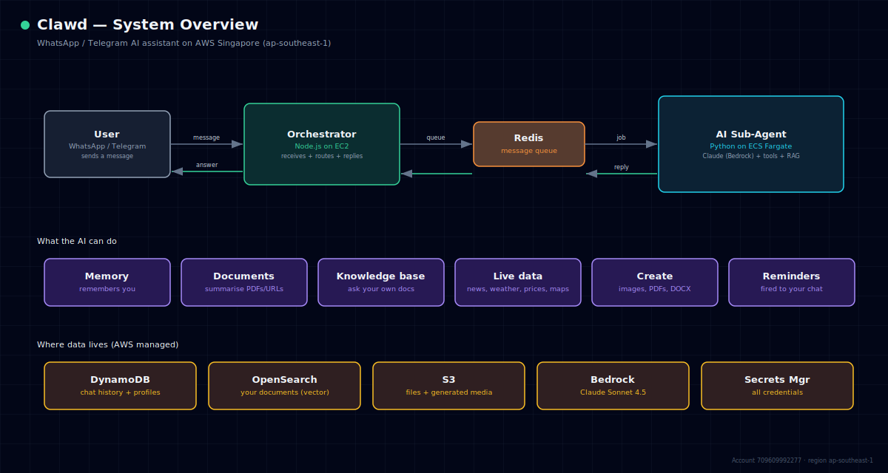

# Clawd — Overview

Clawd is a WhatsApp and Telegram AI assistant for busy professionals in
Singapore and Southeast Asia. There is no app to download — it works inside
the chat app you already use.

> For a presentation-ready version of this diagram (zoomable, with summary
> cards), open **`diagrams/system-overview.html`** in any browser.

## What it does

- **Remembers you** across conversations — name, preferences, context
- **Reads documents** — summarises PDFs and web links you send
- **Personal knowledge base** — answers questions from your own documents
- **Live information** — news, weather, currency, stock & crypto prices, maps
- **Creates content** — generates images, PDF reports, and Word documents
- **Reminders** — fires to the right chat (WhatsApp or Telegram) at the right time
- **Morning digest** — an optional 3-bullet summary at 07:00 SGT

## How it works (in one paragraph)

A user sends a message. An **orchestrator** receives it and places it on a
**message queue**. An **AI sub-agent** picks it up, looks for relevant
documents, calls Claude (Anthropic's model, hosted on AWS Bedrock) along with
any tools it needs, and writes a reply back to the queue. The orchestrator
delivers that reply to the user. The two services never talk directly — the
queue is the only connection between them, which keeps the system simple and
resilient.

## Where it runs

Everything is on **AWS in Singapore (ap-southeast-1)**, account 709609992277.
All customer data stays in-region. Credentials are never embedded in code or
images — they live in AWS Secrets Manager and are injected at runtime.

| Layer | Service |
|---|---|
| Conversation | WhatsApp, Telegram |
| AI model | Claude Sonnet 4.5 via AWS Bedrock |
| Compute | EC2 (orchestrator) + ECS Fargate (AI sub-agent) |
| Memory & data | DynamoDB, OpenSearch, S3, ElastiCache Redis |
| Infrastructure | Terraform (defined as code) |

## Read next

- Technical architecture → [01-architecture.md](01-architecture.md)
- How the AI works → [02-sub-agent.md](02-sub-agent.md)
- Deploying changes → [03-deployment.md](03-deployment.md)
