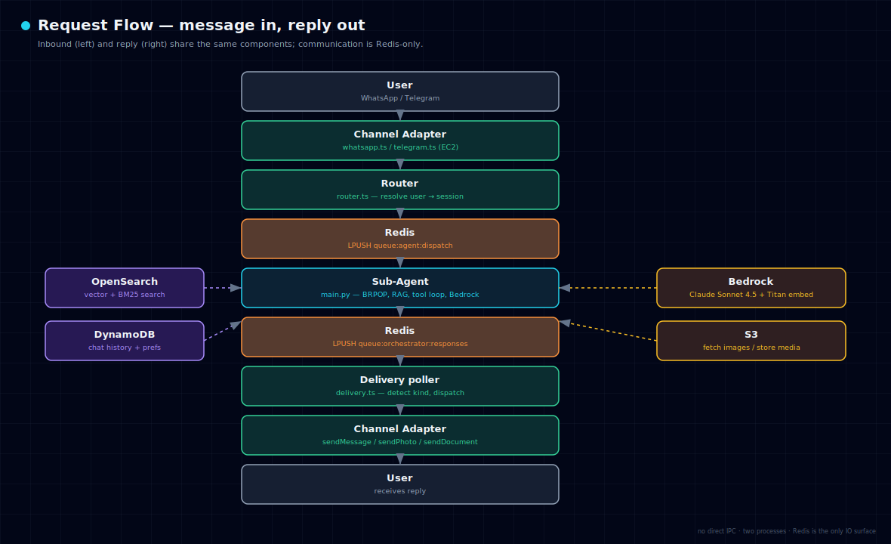

# Architecture

Clawd is a two-process system that communicates exclusively through Redis
queues. There is no direct IPC or shared memory between the two halves.

- **Orchestrator** — Node.js / TypeScript on EC2. Owns the channel adapters
  (WhatsApp, Telegram), routing, and delivery.
- **Sub-agent** — Python on ECS Fargate. Owns the AI: RAG, the tool loop, and
  the Bedrock LLM calls.

## Deployment topology

See [04-aws-resources.md](04-aws-resources.md) for the exact resource names.

## Redis queue keys

| Key | Direction | Purpose |
|---|---|---|
| `queue:agent:dispatch` | orchestrator → sub-agent | shared worker-pool inbound |
| `queue:orchestrator:responses` | sub-agent → orchestrator | all outbound responses |
| `queue:agent:{userId}:dg_response:{reqId}` | data gateway → sub-agent | data-gateway reply |
| `queue:agent:{userId}:dlq` | system | dead-letter (after 3 retries) |
| `nanoclaw:uploads:pending` | adapter → upload worker | inbound media staging |

## Data stores

| Store | Purpose |
|---|---|
| DynamoDB `nanoclaw-chat-messages` | per-user conversation history |
| DynamoDB `nanoclaw-user-preferences` | onboarding state, profile, digest opt-in |
| DynamoDB `nanoclaw-system-errors` | error log |
| DynamoDB `nanoclaw-webhook-tokens` | scheduled-message tokens |
| OpenSearch Serverless `nanoclaw-documents` | per-user document chunks (vector + BM25) |
| S3 `nanoclaw-data-709609992277` | uploaded docs, generated images & PDFs |
| ElastiCache Redis `nanoclaw-redis` | queues, rate limits, reminders, cache |

## Response kinds

The sub-agent writes a plain string to the response queue. The orchestrator's
`delivery.ts` detects the kind and dispatches to the right channel method:

| Marker in response | Kind | Delivered as |
|---|---|---|
| (plain text) | chat | text message |
| `IMAGE_URL:<s3-url>:IMAGE_URL` | image | photo |
| `DOC_URL:<s3-url>:DOC_URL` | document | file |
| `AUDIO_URL:<s3-url>:AUDIO_URL` | audio | audio |

Only URLs under `nanoclaw-data-*.s3.amazonaws.com/media/generated/` are trusted
as media; anything else is delivered as plain text (anti-hallucination guard).

## Inbound media flow

1. Adapter downloads media to the ECS task's local disk
2. Uploads to S3 staging: `users/{userId}/staging/{wa|tg}-{msgId}/{filename}`
3. **Images** are fetched back and passed to Bedrock as vision content blocks
4. **Documents** are pushed to `nanoclaw:uploads:pending` for async indexing

## Background jobs

- **Morning digest** (`src/modules/clawd-wiring.ts`) — 07:00 SGT cron. Scans
  user preferences for `consentGiven && dailyDigestEnabled`, generates a
  3-bullet 24-hour digest per user via Bedrock, delivers via their channel.
  No-ops when nobody is opted in.
- **Reminder loop** (sub-agent) — scans the `reminders:{userId}` Redis sorted
  set every 30s; `channelType` + `platformId` are stored per reminder so each
  fires to the correct platform.
