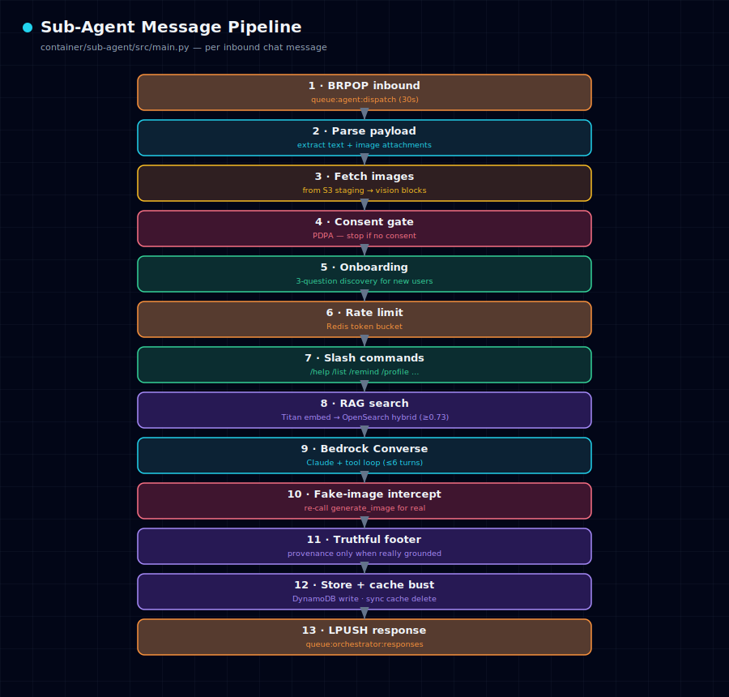

# AI Sub-Agent

The sub-agent is a Python FastAPI service on ECS Fargate. Entry point:
`container/sub-agent/src/main.py`. It is the half of the system that does the
actual AI work.

## Tool registry

Tools are registered in `container/sub-agent/src/tools/__init__.py`
(`TOOL_DEFINITIONS` = Bedrock specs, `_DISPATCH` = name → async callable).

| Tool | What it does |
|---|---|
| `web_search` | Google News RSS + web search, resolves publisher URLs |
| `get_news` | RSS (CNA, BBC, Guardian, Mothership, NYT, ST) |
| `get_weather` | OpenWeatherMap (keyless) |
| `find_place` | Nominatim geocoding, normalises "near X" phrasing |
| `get_directions` | OSRM routing, realistic cycling/walking speeds |
| `get_stock_price` / `get_crypto_price` | Yahoo Finance / CoinGecko |
| `fetch_url` | article extraction (httpx + trafilatura) |
| `generate_image` | Bedrock image model → S3 |
| `generate_document` | reportlab (PDF) / python-docx (DOCX) → S3 |
| `create_reminder` / `list_reminders` / `cancel_reminder` | Redis sorted-set reminders |
| `search_knowledge_base` / `store_note` | direct RAG access |

## LLM client

`container/sub-agent/src/llm/client.py`:

- Model: Claude Sonnet 4.5 via Bedrock Converse, max 4096 tokens
- Tool loop: up to 6 turns (tool_use → tool_result → next turn)
- Vision: image content blocks are prepended *before* the text block (Bedrock requirement)
- History: last N turns from the Redis cache `cache:chat_history:{userId}`
- Blank-content guard: strips empty messages before the call (avoids Bedrock ValidationException)

## RAG pipeline

`container/sub-agent/src/rag/pipeline.py`:

- Embed the user message with Titan Embed v2
- OpenSearch hybrid query: kNN (vector) + match (BM25)
- **Similarity threshold `0.73`** — below-threshold results return empty
- The `no_docs` cache is set **only** when the index is genuinely empty
  (never on a below-threshold near-miss), so a vague query can't suppress RAG
  for later turns
- **Provenance footer is code-owned**, appended only when the answer is really
  grounded in retrieved docs or a real tool ran — never model-self-attested

## Reminders

`container/sub-agent/src/reminders.py` — Redis sorted set `reminders:{userId}`,
score = fire-at timestamp, member JSON carries `{id, text, channelType,
platformId}`. The delivery loop scans every 30s and routes each reminder to the
platform it was created on.

## Error handling

- Tool errors are caught, formatted, and the loop continues
- 45-second hard timeout returns a graceful "taking a bit longer" message
- Messages failing 3× go to `queue:agent:{userId}:dlq`
- Fire-and-forget tasks are held in a module-level `_bg_tasks` set to prevent
  garbage collection before they finish

## Configuration

All config is read from environment variables by pydantic-settings in
`config.py`. The values are injected from Secrets Manager — see
[03-deployment.md](03-deployment.md).
