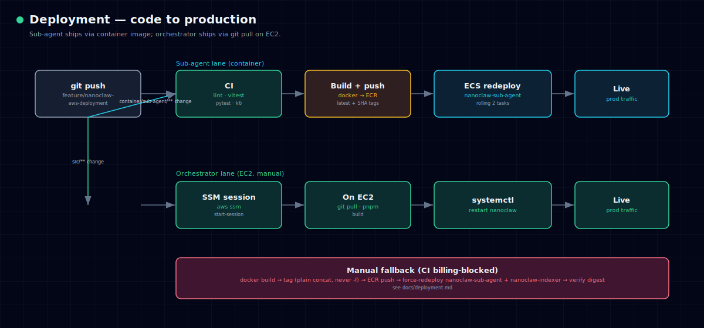

# Deployment

Clawd runs cloud-only on AWS ap-southeast-1 (account 709609992277). Use
`--profile clawd-prod` for all AWS CLI commands.



## What deploys where

| Change location | How it ships |
|---|---|
| `container/sub-agent/**` | container image → ECR → ECS rolling update |
| `src/**` (orchestrator) | git pull + `systemctl restart` on EC2 |
| `infrastructure/terraform/**` | manual `terraform apply` |

## Normal path (CI/CD)

Push to `feature/nanoclaw-aws-deployment` triggers two GitHub Actions:

1. **CI** — `pnpm build`, vitest, `uv run pytest`, gitleaks, k6 load test (error rate < 1%)
2. **Deploy** — docker build, ECR push (latest + SHA), `ecs update-service --force-new-deployment`

Rollout is a rolling replace of 2 tasks; full rollout takes 3–5 minutes.

> **Note:** when CI is unavailable, ship by hand using the manual recipe below.
> The sub-agent and the `nanoclaw-indexer` service share the `nanoclaw/agent`
> image — redeploy **both**.

## Manual sub-agent deploy

```bash
# 1. ECR login
aws ecr get-login-password --region ap-southeast-1 --profile clawd-prod \
  | docker login --username AWS --password-stdin \
    709609992277.dkr.ecr.ap-southeast-1.amazonaws.com

# 2. Build + tag (use plain concatenation for tags — never a format operator)
docker build -t nanoclaw/agent:latest container/sub-agent/
BASE=709609992277.dkr.ecr.ap-southeast-1.amazonaws.com/nanoclaw/agent
docker tag nanoclaw/agent:latest $BASE:latest
docker tag nanoclaw/agent:latest $BASE:feature-latest

# 3. Push
docker push $BASE:latest
docker push $BASE:feature-latest

# 4. Redeploy BOTH services that share the image
aws ecs update-service --cluster nanoclaw-cluster --service nanoclaw-sub-agent \
  --force-new-deployment --profile clawd-prod --region ap-southeast-1
aws ecs update-service --cluster nanoclaw-cluster --service nanoclaw-indexer \
  --force-new-deployment --profile clawd-prod --region ap-southeast-1
```

Poll the rollout to `COMPLETED` and confirm the running task's image digest
matches what you pushed **before** testing (old tasks serve ~50% mid-rollout).

## Manual orchestrator deploy

```bash
aws ssm start-session --target i-0f9cd20350cfdc1a6 \
  --profile clawd-prod --region ap-southeast-1
# On EC2:
cd /opt/nanoclaw && git pull && pnpm install --frozen-lockfile && pnpm build
sudo systemctl restart nanoclaw && sudo systemctl status nanoclaw
```

## Secrets Manager (`nanoclaw/app-config`)

All runtime config lives here. **Never overwrite wholesale — read, merge, write.**

```bash
aws secretsmanager get-secret-value --secret-id nanoclaw/app-config \
  --profile clawd-prod --region ap-southeast-1 --query SecretString --output text \
  | python3 -m json.tool
```

Keys: `LLM_MODEL_ID`, `EMBEDDING_MODEL_ID`, `OPENSEARCH_ENDPOINT`, `REDIS_URL`,
`DYNAMODB_CHAT_TABLE`, `DYNAMODB_PREFS_TABLE`, `DATA_BUCKET`,
`TELEGRAM_BOT_TOKEN`, `WHATSAPP_AUTH_DIR`, `ADMIN_PASS`, `BEDROCK_REGION`.

## OneCLI agent secret mode

A newly spawned agent group starts in **selective** secret mode (no secrets
assigned). If a container gets 401s from AWS APIs despite valid vault creds:

```bash
onecli agents list
onecli agents set-secret-mode --id <id> --mode all
```

## Health checks

```bash
aws ecs describe-services --cluster nanoclaw-cluster --services nanoclaw-sub-agent \
  --profile clawd-prod --region ap-southeast-1 \
  --query 'services[0].{running:runningCount,pending:pendingCount,desired:desiredCount}'

aws logs tail /ecs/nanoclaw-sub-agent --since 30m --profile clawd-prod --region ap-southeast-1
sudo journalctl -u nanoclaw -n 100 --no-pager   # orchestrator, on EC2
```

## Rollback

```bash
aws ecs list-task-definitions --family-prefix nanoclaw-sub-agent --sort DESC \
  --profile clawd-prod --region ap-southeast-1
aws ecs update-service --cluster nanoclaw-cluster --service nanoclaw-sub-agent \
  --task-definition nanoclaw-sub-agent:<PREV_REV> --profile clawd-prod --region ap-southeast-1
```

## Pending work

- **C9** — Caddy + Let's Encrypt TLS on EC2, then swap Telegram to webhook
  (see [06-operations.md](06-operations.md)).
- **C10** — security-group lockdown to known IPs (after C9).
- Microsoft ingestion — add `MICROSOFT_CLIENT_ID` / `MICROSOFT_CLIENT_SECRET`.
