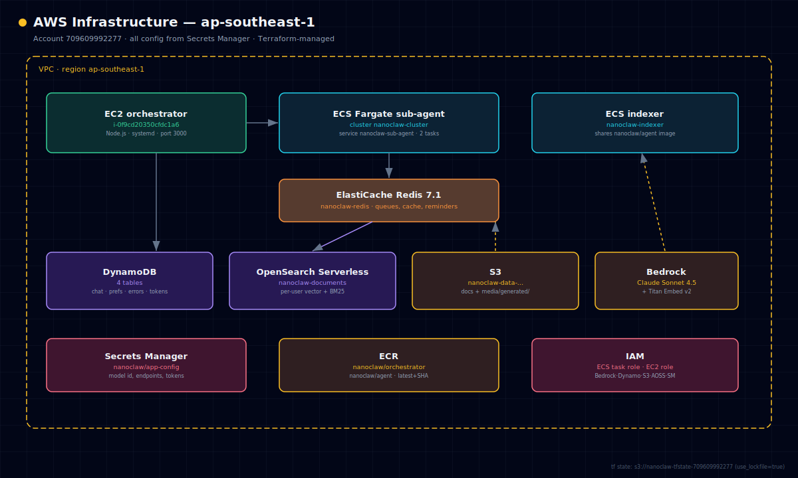

# AWS Resource Inventory

Account 709609992277, region ap-southeast-1. All runtime config is read from
Secrets Manager `nanoclaw/app-config` at boot.

## Compute

| Resource | ID / Name | Notes |
|---|---|---|
| EC2 instance | `i-0f9cd20350cfdc1a6` | orchestrator, Node.js port 3000 |
| ECS cluster | `nanoclaw-cluster` | Fargate |
| ECS service | `nanoclaw-sub-agent` | 2 tasks, rolling update |
| ECS service | `nanoclaw-indexer` | shares the `nanoclaw/agent` image |
| ECR repo | `nanoclaw/orchestrator` | latest + SHA tags |
| ECR repo | `nanoclaw/agent` | latest + SHA tags |

## Storage

| Resource | Name | Notes |
|---|---|---|
| DynamoDB | `nanoclaw-chat-messages` | chat history (TTL) |
| DynamoDB | `nanoclaw-user-preferences` | onboarding, profile, digest opt-in |
| DynamoDB | `nanoclaw-system-errors` | error / audit log |
| DynamoDB | `nanoclaw-webhook-tokens` | scheduled-message tokens |
| S3 | `nanoclaw-data-709609992277` | docs + media (`media/generated/`); versioned |
| OpenSearch Serverless | `nanoclaw-documents` | per-user vector + BM25 chunks |
| ElastiCache Redis | `nanoclaw-redis` (7.1.0) | queues, rate limits, reminders, cache |

## Networking

| Resource | Details |
|---|---|
| Redis endpoint | `nanoclaw-redis.sipa0z.0001.apse1.cache.amazonaws.com:6379` |
| EC2 security group | port 3000 open (admin); 443 pending C9 |
| ECS tasks | no public IP; outbound via NAT gateway |

## Config & state

| Resource | Name |
|---|---|
| Secrets Manager | `nanoclaw/app-config` |
| Terraform state | `s3://nanoclaw-tfstate-709609992277` (S3-native locking, `use_lockfile=true`) |

Do **not** re-add a DynamoDB lock table — it was intentionally removed.

## IAM

| Entity | Notes |
|---|---|
| IAM user `BedrockAPIKey-1gi8` | admin via Terraform group; **key expires — rotate before expiry** |
| ECS task role | DynamoDB, S3, AOSS, Bedrock, Secrets Manager |
| EC2 instance role | same scope + SSM |
